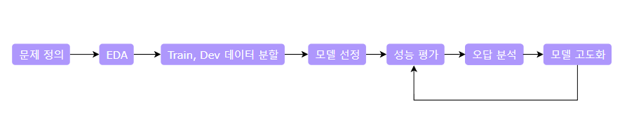

# Upstage [NLP] Visual-information-extraction


<br/>

## Table of contents
1. [Summary](#summary)
3. [Experimental results](#experimental-results)
4. [Instructions](#instructions)
5. [Approach](#approach)
6. [Future work](#future-work)
7. [References](#references)


<br/>

## Summary
스캔된 영어 영수증 이미지에서 Entity를 추출하는 Task입니다 (Key-Value Extraction)

[SROIE 데이터셋](https://arxiv.org/abs/2103.10213)을 사용하며 **입력**으로 문서 이미지 대신 **단어와 그 단어에 해당하는 bounding box 좌표**가 주어졌을 때,\
그 단어에 해당하는 **Entity [company, date, address, total]** 를 맞히는 **NER(Named Entity Recognition) Task**입니다

본 Task를 풀기 위해 [Transformer](https://arxiv.org/abs/1706.03762) Encoder 구조의 사전학습된 모델을 Baseline으로 선정하였고, `TOTAL` 과 `COMPANY` 라벨을 잘 맞히지 못하는 것을 확인했습니다

이를 해결하기 위해 **오답의 특징을 분석**한 후, 

- `모델 관점`에서는 **LayoutLM을 V1부터 V3**까지 시도하며 성능 개선을 시도하였고

- `데이터 관점`에서는 **각 라벨의 문장 내 위치**를 반영해 **Inference 단계에서 후처리**하여 성능 개선을 시도하였습니다

<br/>

## Experimental results

| Model | op_test F1-score | em | em_no_space | #Parameters | steps |
| --- | --- | --- | --- | --- | --- |
| google-bert/bert-base-uncased | 81.42 | 46.18	 | 46.18 | 110M | 600 |
| microsoft/layoutlm-base-uncased | 83.51 | 50.79 | 50.79 | 113M | 800 |
| microsoft/layoutlm-large-uncased | 86.95 | 51 | 51 | 343M | 800 |
| microsoft/layoutlmv2-base-uncased | 84.18 | 52.73 | 52.73 | 199M | 800 |
| microsoft/layoutlmv2-large-uncased | 88.5 | **53.67** | **53.67** | 425M | 800 |
| microsoft/layoutlmv3-base (manual uncased) | 85.52 | 52.23 | 52.23 | 125M | 600 |
| microsoft/layoutlmv3-large (manual uncased) | **89.08** | 53.53 | 53.53 | 356M | 500 |

<br/>

## Instructions

### Hardware
사용한 하드웨어는 다음과 같습니다
- **Local**
    - AMD Ryzen 5 7600 6-Core Processor 3.80 GHz
    - NVIDIA® GeForce® RTX 4060Ti , 8GB
    - OS : WSL2 Ubuntu 20.04

- **Google Colab**
    - Intel(R) Xeon(R) 8-Core Processor 2.20GHz
    - NVIDIA® L4 , 24GB 

<br/>

### Conda environment setup
Mac, Windows, Linux에서 [conda](https://docs.continuum.io/free/anaconda/install/)를 설치합니다

1. conda를 업데이트합니다

   ```
   conda update conda
   ```

2. 가상환경을 만듭니다

   ```
   conda env create -f env/requirements.yml
   ```

   - 위를 통해 본 레포지토리에 필요한 모든 패키지들이 설치된 `Upstage_NLP_Task`라는 이름의 conda 가상환경이 생성됩니다


3. 새로운 가상환경을 활성화합니다

   ```
   conda activate Upstage_NLP_Task
   ```

   또는 아래와 같은 방법도 가능합니다

   ```
   source activate Upstage_NLP_Task
   ```

<br/>

### Code structure
```
┣ 📂.github
┃ ┣ 📂ISSUE_TEMPLATE
┃ ┃ ┣ 📜bug_report.md
┃ ┃ ┗ 📜feature_request.md
┃ ┣ 📜.keep
┃ ┗ 📜PULL_REQUEST_TEMPLATE.md
┣ 📂data_analysis
┃ ┣ 📜analysis_bboxes.ipynb
┃ ┣ 📜analysis_error.ipynb
┃ ┣ 📜analysis_metric.ipynb
┃ ┣ 📜analysis_total_label.ipynb
┃ ┣ 📜analysis_train_dev_split.ipynb
┣ 📂docs
┃ ┣ 📂img
┃ ┣ 📜EDA.md
┃ ┣ 📜baseline_results.md
┃ ┣ 📜error_analysis.md
┃ ┣ 📜layoutlmv2_results.md
┃ ┣ 📜layoutlmv3_results.md
┃ ┣ 📜metric.md
┃ ┣ 📜model_selection.md
┃ ┗ 📜overview.md
┣ 📂env
┃ ┣ 📜requirements.txt
┃ ┗ 📜requirements.yml
┣ 📂logs
┃ ┣ 📜bert-base.log
┃ ┣ 📜layoutlm-base.log
┃ ┗ 📜layoutlm-large.log
┣ 📜.gitignore
┣ 📜README.md
┣ 📜evaluation.py
┣ 📜inference.py
┣ 📜train.py
┣ 📜train_dev_split.py
┗ 📜utils.py
```

<br/>

### Usage instructions

#### Download Data

```
https://aistages-api-public-prod.s3.amazonaws.com/app/Competitions/000230/data/data.tar.gz
```
- 데이터를 다운로드하고 압축을 푼 후, `../input/data` 경로에 위치시킵니다

<br/>

#### Train Dev Split

```
python train_dev_split.py
```
- Train, Dev 데이터를 분할합니다
- 분할된 Train, Dev 데이터는 `../input/data`에 위치합니다

<br/>

#### Wandb Login

   ```
   wandb login
   ``` 
- wandb를 통한 train loss와 dev evaluation 결과를 추적하기 위해 로그인합니다

<br/>

#### Training

`train.py` 파일 하나로 진행할 수 있습니다

중요한 command line option은 아래와 같습니다. 자세한 옵션은 [다음](./train.py#L342)에서 확인하실 수 있습니다

   - `--model_name_or_path` : 모델 이름 혹은 경로
   - `--model_type` : 모델 타입
   - `--do_lower_case` : Tokenizer의 입력을 소문자로 변경
   - `--do_train` : 학습 실행 여부
   - `--num_train_epoch` : 학습 epoch 수
   - `--overwrite_model_dir` : 학습 중 checkpoint는 `/model`이라는 폴더에 저장됨. 만약, 비어있지 않을 경우 초기화
   - `--evaluate_during_training` : 학습을 진행하면서 일정 주기마다 dev 데이터에 대한 evaluation을 진행
   - `--convert_to_uncased` : layoutlmv3를 학습하는 경우, Tokenizer의 입력을 수동으로 uncased로 만들주기 위해 사용


<br/>

##### Single GPU
```
python train.py \
      --model_name_or_path 'microsoft/layoutlmv3-base' \
      --model_type layoutlmv3 \
      --do_lower_case \
      --do_train \
      --num_train_epochs 15 \
      --overwrite_model_dir \
      --evaluate_during_training \
      --convert_to_uncased
```

<br/>

#### Inference
`inference.py` 파일 하나로 실행할 수 있습니다

중요한 command line option은 아래와 같습니다. 자세한 옵션은 [다음](./inference.py#L67)에서 확인하실 수 있습니다

   - `--model_name_or_path` : 학습된 모델 checkpoint 경로
   - `--model_type` : 모델 타입
   - `--do_lower_case` : Tokenizer의 입력을 소문자로 변경
   - `--do_predict` : Inference 실행 여부
   - `--mode` : 어떤 데이터를 가지고 inference를 진행할 것인지 설정 [ `test`, `op_test`, `dev` ]
   - `--convert_to_uncased` : layoutlmv3를 학습하는 경우, Tokenizer의 입력을 수동으로 uncased로 만들주기 위해 사용

<br/>


##### Single GPU
```
python inference.py \
      --model_name_or_path '{checkpoint path}' \
      --model_type {model_type} \
      --do_lower_case \
      --do_predict \
      --max_seq_length 512 \
      --mode {mode} 
```

<br/>

#### Evaluation
inference를 진행하게 되면 예측 `output.csv` 파일이 `./output` 경로에 위치하게 됩니다

예측값과 실제 op_test 간의 `f1-score`, `em`, `em_no_space`를 구하려면 다음 코드를 실행합니다

```
python evaluation.py
```


<br/>
<br/>


## Approach

실험은 다음과 같은 [Flow](./docs/flow.md#flow)로 진행하였습니다



<br/>

### | 문제 정의
- 풀어야 하는 **Task와 Data를 파악**했습니다

   - **Task**
      - 스캔된 영어 영수증 이미지에서 Entity를 추출하는 Task입니다 (Key-Value Extraction)

      - [SROIE 데이터셋](https://arxiv.org/abs/2103.10213)을 사용하며 **입력**으로 문서 이미지 대신 **단어와 그 단어에 해당하는 bounding box 좌표**가 주어졌을 때, \
      그 단어에 해당하는 **Entity [company, date, address, total]** 를 맞히는 **NER(Named Entity Recognition) Task**입니다

   - **Data**

      - `*/entites` : 각 이미지에 대한 entity key-value 추출 정보
      - `*/img` : SROIE 데이터셋의 이미지 파일들
      - `*.txt` : 각 바운딩 박스에 대한 BIO 태그 정보가 conll 형식으로 제공
      - `*_image.txt` : 각 이미지의 각 바운딩 박스에 대한 좌표 정보
      - `*_box.txt` : 각 바운딩 박스의 정규화된 좌표 정보
      - `*/entities`는 훈련 또는 테스트일 수 있습니다 (예: /entities → train/entities)

<br/>

- 높은 평가지표 점수를 가지는 모델을 만드는 것이 목적이기 때문에 **평가지표를 분석**하였습니다

   - dev 데이터에 대해서는 utils.py의 [evaluate함수](./utils.py#L429)를 통해 f1-score를 구하지만,\
   op_test 데이터에 대한 최종 f1-score는 evaluation.py에 구현되어있는 방식으로 f1-score를 구합니다

   - 이 두 방식의 차이로 인해 생기는 dev validation과 op_test validation간의 심한 성능 차이를 해결하기 위해\
   dev 데이터를 통한 성능 평가 지표를 기존 micro-avg f1-score에서 macro-avg f1-score로 변경했습니다
   - 자세한 내용은 [metric](./docs/metric.md#metric)에서 확인해볼 수 있습니다


<br/>

### | EDA
- 데이터를 더욱 자세하게 살펴봅니다
- **이상치**, **결측치**를 확인하고 **feature간의 연관성을 파악**합니다
   - 데이터셋 내에 max_sequence_length를 넘어가는 샘플 개수를 파악합니다
   - 라벨이 존재하지 않는 샘플을 파악합니다
   - 라벨별 bounding box의 위치 분포를 확인하여 Token 이미지의 bounding box 좌표가\
   Token Classification 문제 해결에 도움을 줄 수 있는지 확인합니다
- 자세한 내용은 [EDA](./docs/EDA.md)에서 확인해볼 수 있습니다


<br/>

### | Train, Dev 데이터 분할
- EDA를 통해 파악한 결과를 바탕으로 **Train, Dev 데이터를 분할**합니다
- 이때 고려한 조건은 `Dev와 Test간의 분포`, `적절한 Dev 크기`입니다
- 결과적으로, Train과 Dev 데이터셋을 8:2로 랜덤 샘플링하여 분리하였습니다
   - 자세한 내용은 [학습 데이터셋](./docs/baseline_results.md#학습-데이터셋)에서 확인해볼 수 있습니다

<br/>

### | 모델 선정
- 다음을 고려하여 **Baseline 모델을 선정**합니다
   - `모델 구조와 Task간의 연관성`
   - `사전학습 방식과 Task간의 연관성`
   - `EDA를 통해 얻은 데이터의 특징` 

- 최종적으로 다음 3가지 모델을 선정했습니다
   - `BERT-uncased`
   - `RoBERTa`
   - `LayoutLM-uncased`
- 자세한 내용은 [model_selection](./docs/model_selection.md)에서 확인해볼 수 있습니다
- 또한 이들의 모델 구조와 Fine-tuning Method는 [overview](./docs/overview.md)에서 확인해볼 수 있습니다

<br/>


### | 성능 평가 - 오답 분석  - 모델 고도화
- 모델의 **성능을 먼저 정량적으로 평가**합니다
- 이후, **Dev 데이터셋에 대해 틀리는 데이터의 특징을 분석**합니다
- 해당 **오답을 개선할 수 있는 아이디어를 제안하고 적용**합니다
- 위 과정을 반복했습니다

<br/>

- 가장 먼저, **baseline 모델간의 성능과 오답을 분석**한 결과

   - bert에 비해 bounding box의 레이아웃 정보를 추가적으로 사용하는 LayoutLM이 더 좋은 성능을 보였습니다
   - 이는 앞서 **bounding box 레이아웃 정보**가 **라벨별로 상이한 분포**를 띄기 때문에 이 정보를 사용한 것으로 볼 수 있습니다
   - 해당 분포에 대한 시각화 정보는 [analysis_bboxes](./data_analysis/analysis_bboxes.ipynb#label별-box의-center-위치-분포-확인)의 맨 하단에서 확인하실 수 있습니다

   <br/>

   - 하지만, `TOTAL` 라벨에 대한 점수가 낮다는 것을 발견하고 오답 분석을 했습니다

      - 틀리는 `TOTAL` 라벨과 맞히는 `TOTAL`라벨간의 차이를 확인한 결과

        - `$`라는 화폐단위가 붙는 `TOTAL` 라벨의 경우 전부 맞히는 것을 볼 수 있었습니다
        - `rm`이라는 화폐 단위가 붙는 `TOTAL`의 경우 맞히는 것을 어려워 하는 것을 확인했습니다
          - 그 이유는, 해당 샘플 안에 `rm`이라는 단어가 다수 존재하기 때문으로 보입니다

        - 하지만, 라벨이 `TOTAL`에 해당하는 개별 Token 단위에서 틀리는 Token과 그렇지 않은 Token간의 차이점은 발견할 수 없었습니다

   - `TOTAL` 라벨에 해당하는 Token의 이미지들을 정성 분석했습니다
      - 그 결과, `TOTAL` 라벨에 해당하는 Token들이 대부분 **굵은(Bold) 글씨** 로 되어있는 것을 확인했습니다
      - 이에 각 Token에 해당하는 `이미지 정보`까지 반영하기 위해 LayoutLMV2를 적용했습니다

   - 자세한 내용은 [baseline_results](./docs/baseline_results.md)에서 확인할 수 있습니다

<br/>
<br/>

- **LayoutLMV2 모델의 성능과 오답을 분석**한 결과

   - layoutlm의 문제였던 `TOTAL` 라벨에 대한 성능이 확연히 개선됨을 확인했습니다
   
   - 하지만, 여전히 `TOTAL`과 `COMPANY` 라벨을 풀기 어려워 하는 것을 확인했습니다

   - 이 문제를 보완하기 위해, `이미지`와 `텍스트`간의 Misalignment 문제를 개선한 **LayoutLMV3 모델**을 적용했습니다

   <br/>

   - 또한, `TOTAL`과 `COMPANY`라벨의 문장 내 위치에 대한 추가 분석을 통해 다음과 같은 정보를 알아냈습니다

      - `TOTAL` 라벨에 해당하는 Token의 경우 해당 Token의 앞에 `TOTAL이라는 Text Token`이 존재하는 경우가 많다!
         - 즉, `TOTAL : 가격` 과 같은 형태의 샘플이 정말 많기 때문에, \
         Inference 단계에서 `TOTAL`이라는 라벨을 예측할 때에는 앞에 `TOTAL이라는 Text Token이 존재하는가?`를 제약 조건으로 놓을 수 있습니다
         - 이를 통해 만약 `TOTAL이라는 Text 앞에서 TOTAL로 잘못 예측`하는 것을 방지할 수 있습니다

      - `COMPANY`라벨에 해당하는 Token의 경우 전체 Text의 앞부분에 오는 것을 확인했습니다
         - 이를 통해, Inference 단계에서 `전체 Text의 뒷부분에서 COMPANY로 잘못 예측`하는 것을 방지할 수 있습니다

   - 자세한 내용은 [layoutlmv2_results](./docs/layoutlmv2_results.md)에서 확인할 수 있습니다

<br/>
<br/>

- **layoutLMv3 모델의 성능과 오답을 분석**한 결과

   - dev 데이터셋에 대해서는 layoutlmv2에 비해 성능이 소폭 하락했지만, op_test 데이터셋에 대해서는 좋은 성능을 보이는 것을 확인했습니다

   - 현재 LayoutLMV3는 uncased 모델을 지원하지 않습니다
      - 하지만, train 데이터는 대문자로만 구성되어있고 op_test 데이터는 대소문자로 구성되어있기 때문에\
      이 둘 간의  분포를 맞춰주기 위해 trian과 dev, op_test의 텍스트를 Tokenizing 하기 전\
      `소문자 변환` + `악센트 제거`라는 전처리 과정을 추가해줬습니다
      - 이를 통해 같은 조건에서 1.3점 정도의 op_test F1-score 향상을 얻어낼 수 있었습니다

   - 자세한 내용은 [layoutlmv3_results](./docs/layoutlmv3_results.md)에서 확인할 수 있습니다


<br/>
<br/>


- **`total이라는 텍스트`는 항상 `TOTAL 라벨 Token`의 앞에 오는지**를 분석한 결과
   - 가장 먼저, `626`개의 (train + dev) 데이터 중에서, 5개의 샘플을 제외하고는 `total이라는 텍스트`가 존재함을 확인했습니다
   - 그렇다면, `Total : [가격]` 처럼 `total이라는 텍스트`는 항상 `TOTAL 라벨 Token`앞 오는지를 분석해보니
      - `621`개의 샘플 중에서 
         - `524`개는 `Total : [가격]`처럼 `total이라는 텍스트`가 먼저 왔고
         - `97`개는 뒤에 오는 것을 확인했습니다

   - `97`개나 되는 예외 샘플도 존재하기 때문에, 강제로 이 조건을 만족하도록 후처리를 한다면\
   성능 하락이 예상되었습니다
   - 실제로 `layoutlmv3-large (uncased)`모델로 이 조건을 만족하도록 후처리한 결과\
   op_test f1-score가 `89.08` → `87.24`로 크게 떨어짐을 확인했습니다

   - 자세한 내용은 [analysis_total_label](./data_analysis/analysis_total_label.ipynb)에서 확인할 수 있습니다.

<br/>
<br/>


### Future work

- 이번 Competition에서는 확실한 근거에 기반하지 않는 무작위성 실험은 지양하였기에 진행하지 않았지만,\
  아래와 같은 시도는 큰 성능 향상이 기대됩니다!

   - Ensemble
   - Hyperparameter Tuning(seed, batch_size, learning_rate, weight_decay_rate, learning scheduler)
   - DAPT(Domain-Adaptive Pretraining) or TAPT(Task-Adaptive Pretraining)


<br/>

- **보다 질 좋은 이미지 feature를 뽑아내기 위해, 영수증 이미지를 Upscaling할 수 있습니다!**

   이미지를 정성분석 한 결과, 노이즈가 꽤나 많이 존재함을 확인했습니다

   - 스캔 상태가 좋지 못하거나 수정테이프로 인해 글자가 지워지거나,
   - 얼룩이나 도장이 찍혀있거나,
   - 먼지와 같은 잡티가 문자를 가리거나,
   - 펀치홀로 인해 글자가 짤려나가거나,
   - 영수증이 구겨지거나 찢어지거나,
   - 글자가 너무 흐리거나,
   - 영수증이 회전되어있는 것을 확인했습니다

   위와 같은 `노이즈를 제거`하거나, `빈 곳을 채워넣는 식`으로 **보다 깔끔하고 선명한 이미지**를 만든다면\
   모델이 이미지의 조각 정보를 인식하고 그 조각과 텍스트간의 패턴을 파악하는데 도움을 줄 수 있을 것입니다


<br/>
<br/>

## References
- [Upstage Logo](https://ko.upstage.ai/brand-resource-center)
- [ICDAR2019 Competition on Scanned Receipt OCR and Information Extraction](https://arxiv.org/abs/2103.10213)
- [Attention Is All You Need](https://arxiv.org/abs/1706.03762)
- [Don't Stop Pretraining: Adapt Language Models to Domains and Tasks](https://arxiv.org/abs/2004.10964)
