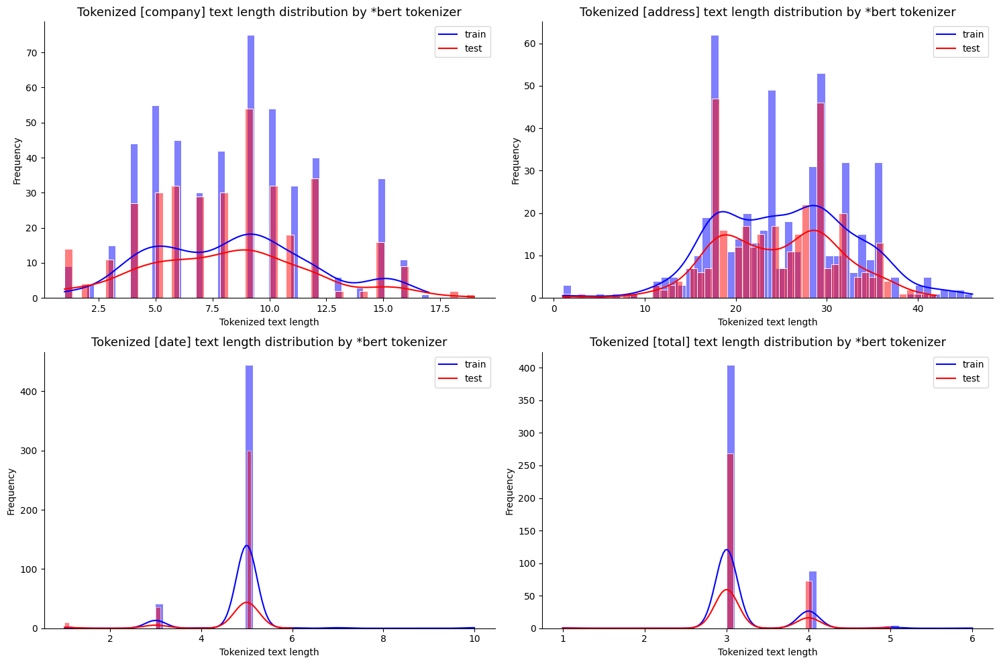
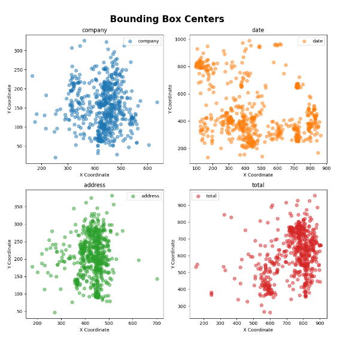

# EDA(Exploratory Data Analysis)
데이터의 성질, 데이터의 온전함, feature간의 연관성을 확인합니다

<br/>

## 목차

- **데이터셋 구조**

- **자세한 데이터 파악**
    - **entities**
    - **img**
    - **train.txt / test.txt / op_test.txt**
    - **train_image.txt / test_image.txt / op_test_image.txt**
    - **train_box.txt / test_box.txt / op_test_box.txt**

- **데이터 분석**
    - **max_sequence_length를 넘는 sequence가 존재하는가?**
        - 전체 train, test 데이터에 대해 샘플별 Input 토큰 개수 확인
        - 전체 train, test 데이터에 대해 라벨별 Input 토큰 개수 확인
        - 최대 토큰 개수 (512)를 넘어가는 샘플 확인
          
    - **샘플별 4개의 라벨을 모두 가지고 있는가?**
        - 라벨이 존재하지 않는 샘플 확인
     
    - **라벨과 박스의 위치간의 연관성이 존재하는가?**
        - 라벨별 boxes의 위치 분포 확인

<br/>

## 데이터셋 구조

각 파일은 다음과 같은 정보로 이루어져 있습니다

- `/entites` : 각 이미지에 대한 entity key-value 추출 정보
- `/img` : SROIE 데이터셋의 이미지 파일들
- `.txt` : 각 바운딩 박스에 대한 BIO 태그 정보가 [conll 형식](https://simpletransformers.ai/docs/ner-data-formats/#text-file-in-conll-format)으로 제공
- `_image.txt` : 각 이미지의 바운딩 박스에 대한 좌표 정보
- `_box.txt` : 각 바운딩 박스의 정규화된 좌표 정보

- `/entities`는 훈련 또는 테스트일 수 있습니다 (예: /entities → train/entities)

<br/>

## 자세한 데이터 파악

### | entities
- train/entities와 test/entities로 이루어져 있습니다
- 각 파일은 `.txt`로 구성이 되어 있으며 파일 안에는 (key-value) 형태의 (`라벨`-`정답`)이 들어있습니다
- 이 파일은 evaluation.py를 통해 각 라벨에 해당하는 정답을 가져올 때 사용합니다

- 예시) X00016469612.txt
```
    {
    "company": "BOOK TA .K (TAMAN DAYA) SDN BHD",
    "date": "25/12/2018",
    "address": "NO.53 55,57 & 59, JALAN SAGU 18, TAMAN DAYA, 81100 JOHOR BAHRU, JOHOR.",
    "total": "9.00"
    }
```

<br/>

### | img
- train/img와 test/img로 이루어져 있습니다
- 각 파일은 `.jpg`로 구성되어 있으며 실제 이미지에 해당하는 이미지가 담겨있습니다

- 예시) X00016469612.jpg

    

<br/>

### | train.txt / test.txt / op_test.txt
- 학습에 직접적으로 사용되는 데이터입니다
- 각 파일은 `.txt`로 구성되어 있으며 줄마다 (`단어`-`라벨`) 쌍이 `\t`를 기준으로 분리되어 있습니다
- 각 샘플은 `\n`를 기준으로 분리되어 있습니다
- 라벨은 `O`, `S-COMPANY`, `S-ADDRESS`, `S-DATE`, `S-TOTAL`로 구성되어 있습니다.
- train.txt와 test.txt는 `단어`가 모두 대문자인 반면, op_test.txt의 경우 `단어`가 대소문자로 이루어져 있습니다
    - 그렇기 때문에 만약 대소문자를 구분하는 모델의 경우 학습데이터에는 대문자밖에 존재하지 않아\
    제대로 학습되지 않을 수 있습니다 ! 
    - 그래서 입력을 모두 소문자로 통일해주기 위해 사용하는 모델은 `uncased`모델을 사용하고 \
    tokenizer의 `do_lower_case`인자를 `True`로 놓고 사용합니다

- 예시) train.txt
    ```
    TAN	O
    WOON	O
    YANN	O
    MR	S-COMPANY
    D.I.Y.	S-COMPANY
    (M)	S-COMPANY
    SDN	S-COMPANY
    BHD	S-COMPANY
    (CO.	O
    RFG	O
    :	O
    860671-D)	O
    LOT	S-ADDRESS
    1851-A	S-ADDRESS
    &	S-ADDRESS
    1851-B,	S-ADDRESS
    JALAN	S-ADDRESS
    KPB	S-ADDRESS

    ```

<br/>

### | train_image.txt / test_image.txt / op_test_image.txt
- 각 파일은 .txt로 구성되어 있으며 각 줄마다 \
(`단어`-`이미지 내 해당 단어가 존재하는 박스의 위치`-`이미지 크기`-`파일 이름`)이 `\t`를 기준으로 분리되어 있습니다
- 각 샘플은 `\n`을 기준으로 분리되어 있습니다
- 박스의 위치는 4개로 구성이 되어 있으며 각 원소는\
[`왼쪽 상단 x좌표`, `왼쪽 상단 y좌표`, `오른쪽 하단 x좌표`, `오른쪽 하단 y좌표`]를 의미합니다

- 예시) train_image.txt
    ```
    TAN	    83 41 140 78	463 1026	X00016469623
    WOON	145 41 221 78	463 1026	X00016469623
    YANN	226 41 302 78	463 1026	X00016469623
    MR	    109 171 130 191	463 1026	X00016469623
    D.I.Y.	135 171 198 191	463 1026	X00016469623
    (M)	203 171 234 191	463 1026	X00016469623
    SDN	239 171 270 191	463 1026	X00016469623
    BHD	275 171 306 191	463 1026	X00016469623
    (CO.	122 190 162 213	463 1026	X00016469623
    RFG	    167 190 197 213	463 1026	X00016469623
    :	    202 190 212 213	463 1026	X00016469623
    860671-D)	217 190 308 213	463 1026	X00016469623
    LOT	    47 208 78 233	463 1026	X00016469623
    1851-A	83 208 145 233	463 1026	X00016469623
    ```

<br/>

### | train_box.txt / test_box.txt / op_test_box.txt
- 각 파일은 `.txt`로 구성되어 있으며 각 줄마다\
(`단어`-`이미지 내 해당 단어가 존재하는 박스의 정규화된 위치`) 쌍이 `\t`를 기준으로 분리되어 있습니다
- 여기서 정규화란 모든 이미지를 1000x1000 크기로 맞추는 것을 의미합니다
- LayoutLM을 이용해 모델을 학습한다면 이를 이용할 수 있습니다

- 예시) train_box.txt
    ```
    TAN	    179 39 302 76
    WOON	313 39 477 76
    YANN	488 39 652 76
    MR	235 166 280 186
    D.I.Y.	291 166 427 186
    (M)	    438 166 505 186
    SDN	    516 166 583 186
    BHD	    593 166 660 186
    (CO.	263 185 349 207
    RFG	    360 185 425 207
    :	436 185 457 207
    860671-D)	468 185 665 207
    LOT	    101 202 168 227
    1851-A	179 202 313 227
    ```

<br/>
<br/>

## 데이터 분석

### | max_sequence_length를 넘는 sequence가 존재하는가?
- max_sequence_length를 넘는 sequence가 존재하는 경우 짤리는 token이 발생하여 학습이 제대로 이루어지지 않을 수 있습니다
- 또한, Input token 개수의 최대치를 확인하면 학습에 사용되는 PAD 토큰을 최대한 줄여 학습을 용이하게 할 수 있습니다

- 이를 확인하기 위해 다음을 확인합니다
    - 전체 train, test 데이터에 대해 샘플별 Input 토큰 개수 확인
    - 전체 train, test 데이터에 대해 라벨별 Input 토큰 개수 확인
    - 최대 토큰 개수 (512)를 넘어가는 샘플 확인

<br/>

**전체 train, test 데이터에 대해 샘플별 Input 토큰 개수 확인**
- tokenizer로는 Baseline 모델로 사용할 [BERT](https://arxiv.org/pdf/1810.04805v2)의 BertTokenizer를 사용합니다
- do_lower_case=True
- BertTokenizer는 WordPiece를 이용해 구성됩니다

- train과 test 데이터에 대한 각 샘플별 Input의 길이 분포는 아래와 같습니다

    

    - 통계치는 아래와 같습니다\
    (train set) : Max length: 569 | Mean length: 251.82 | Median length: 240.0\
    (test set) : Max length: 520 | Mean length: 249.17 | Median length: 235.0
    
    - 최대 train과 test의 최대 Input 토큰 개수는 `569`, `520`이며\
    default로 설정되어있는 최대 Input 토큰 개수인 `512`를 넘어가는 샘플의 개수는 train과 test에서 각각 `3개`, `1개` 입니다
    - 해당 이상치에 대해서는 [analysis_train_dev_split.ipynb](../data_analysis/analysis_train_dev_split.ipynb)에서 확인하실 수 있습니다

<br/>

**전체 train, test 데이터에 대해 라벨별 Input 토큰 개수 확인**
- 이번에는 라벨별로 Input의 길이 분포를 확인합니다
- 이는 [평가지표 분석](./metric.md)에서 라벨별 support의 개수 분포를 확인할때 사용될 수 있습니다

- train과 test 데이터에 대한 각 라벨별 Input의 길이 분포는 아래와 같습니다


    

    - 통계치는 아래와 같습니다

        [Statistics of tokenized `"company"` text length by *bert tokenizer]\
        &nbsp; &nbsp; (Train set) : Max length: 17 | Mean length: 8.40 | Median length: 9.0\
        &nbsp; &nbsp; (Test set)  : Max length: 19 | Mean length: 8.22 | Median length: 8.0

        [Statistics of tokenized `"address"` text length by *bert tokenizer]\
        &nbsp; &nbsp; (Train set) : Max length: 46 | Mean length: 25.47 | Median length: 25.0\
        &nbsp; &nbsp; (Test set)  : Max length: 42 | Mean length: 24.70 | Median length: 25.0
        
        [Statistics of tokenized `"date"` text length by *bert tokenizer]\
        &nbsp; &nbsp; (Train set) : Max length: 10 | Mean length: 4.84 | Median length: 5.0\
        &nbsp; &nbsp; (Test set)  : Max length: 6 | Mean length: 4.68 | Median length: 5.0

        [Statistics of tokenized `"total"` text length by *bert tokenizer]\
        &nbsp; &nbsp; (Train set) : Max length: 6 | Mean length: 3.19 | Median length: 3.0\
        &nbsp; &nbsp; (Test set)  : Max length: 5 | Mean length: 3.23 | Median length: 3.0 

- `company`, `address`가 상대적으로 길며, `date`와 `total`이 상대적으로 짧습니다

<br/>
<br/>

### | 샘플별 4개의 라벨을 모두 가지고 있는가?
- 결측치를 찾기 위해 샘플별로 모두 4개의 라벨을 전부 가지고 있는지 확인합니다
- 총 4개의 라벨에서 1개의 라벨도 존재하지 않는 샘플의 경우는 제거합니다

<br/>

**라벨이 존재하지 않는 샘플 확인**
- train 데이터에서 1개라도 라벨이 존재하지 않는 샘플이 `24개` 존재하며 자세한 내용은 아래와 같습니다
    ```
    No text found for company in X51005361907
    ------------------------------------------------
    No text found for address in X51005433522
    No text found for total in X51005433522
    ------------------------------------------------
    No text found for company in X51005441398
    ------------------------------------------------
    No text found for company in X51005442361
    ------------------------------------------------
    No text found for date in X51005447850
    ------------------------------------------------
    No text found for address in X51005663280
    ------------------------------------------------
    No text found for date in X51005719902
    ------------------------------------------------
    No text found for company in X51005719917
    ------------------------------------------------
    No text found for company in X51005749895
    ------------------------------------------------
    No text found for date in X51005749912
    ------------------------------------------------
    No text found for date in X51006335547
    ------------------------------------------------
    No text found for company in X51006388082
    ------------------------------------------------
    No text found for company in X51006392122
    No text found for address in X51006392122
    ------------------------------------------------
    No text found for company in X51006392273
    ------------------------------------------------
    No text found for date in X51006401869
    ------------------------------------------------
    No text found for company in X51006414700
    ------------------------------------------------
    No text found for company in X51006466055
    No text found for date in X51006466055
    No text found for address in X51006466055
    ------------------------------------------------
    No text found for total in X51006466060
    ------------------------------------------------
    No text found for company in X51006556838
    ------------------------------------------------
    No text found for address in X51007231370
    ------------------------------------------------
    Number of examples with no text: 24
    ```

- test 데이터에서 1개라도 라벨이 존재하지 않는 샘플이 `26개` 존재하며 자세한 내용(라벨-샘플 이름)은 아래와 같습니다
    ```
    No text found for date in X51005200931
    ------------------------------------------------
    No text found for company in X51005337867
    ------------------------------------------------
    No text found for company in X51005361906
    ------------------------------------------------
    No text found for company in X51005442322
    No text found for date in X51005442322
    ------------------------------------------------
    No text found for total in X51005684949
    ------------------------------------------------
    No text found for company in X51005715455
    ------------------------------------------------
    No text found for company in X51005719898
    ------------------------------------------------
    No text found for date in X51005724552
    ------------------------------------------------
    No text found for company in X51005724623
    ------------------------------------------------
    No text found for company in X51005763999
    ------------------------------------------------
    No text found for date in X51006327960
    ------------------------------------------------
    No text found for date in X51006328345
    ------------------------------------------------
    No text found for address in X51006349085
    ------------------------------------------------
    No text found for date in X51006388081
    ------------------------------------------------
    No text found for date in X51006389894
    ------------------------------------------------
    No text found for company in X51006414600
    ------------------------------------------------
    No text found for company in X51006619328
    ------------------------------------------------
    No text found for company in X51006619790
    ------------------------------------------------
    No text found for company in X51006619842
    No text found for date in X51006619842
    ------------------------------------------------
    No text found for date in X51006619869
    ------------------------------------------------
    No text found for date in X51006620192
    ------------------------------------------------
    No text found for company in X51006912959
    ------------------------------------------------
    No text found for company in X51007846400
    ------------------------------------------------
    No text found for company in X51007846403
    ------------------------------------------------
    Number of examples with no text: 26
    ```

<br/>

- 확인 결과, 모든 샘플이 적어도 1개 이상의 라벨을 가지고 있습니다

<br/>
<br/>

### | 라벨과 박스의 위치간의 연관성이 존재하는가?
- 라벨과 box의 위치 사이의 연관성이 존재한다면 모델에 도움이 될 수 있는 정보가 될 수 있습니다
- 이 연관성이 존재하기 떄문에 이를 이용해 학습한 모델이 [LayoutLM](https://arxiv.org/abs/1912.13318)입니다

<br/>

**라벨별 boxes의 위치 분포 확인**
- train 데이터에 대해 각 라벨별 box의 중심 위치를 산점도로 확인해보니 라벨별로 특정 분포를 띠는 것을 확인할 수 있습니다
- 이를 통해 라벨과 box의 위치 사이의 연관성이 존재한다는 것이 확인되었기에 \
layoutLM을 활용해 fine-tuning을 한다면 좋은 성능을 기대할 수 있습니다

    
