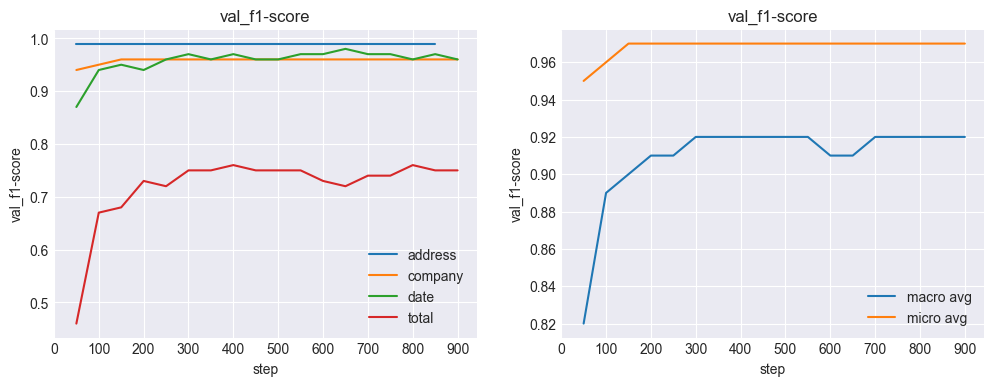

# Baseline 성능 평가
baseline 모델의 성능을 평가합니다

<br/>

## 목차
- **최고 성능 모델 선정 기준 (평가 지표)**

- **학습 데이터셋**
- **결과**
- **결과 기반 Basleine을 고도화 전략**

<br/>

## 최고 성능 모델 선정 기준 (평가 지표)

학습 중간마다 특정 step(default : 50)이 학습되면, [평가지표 분석](./metric.md)에서 설명했던 방식대로

dev 데이터셋에 대한 현재 모델의 `micro avg f1-score`를 seqeval.metric.f1_score를 이용해 구했었습니다

하지만, 아래에 기술할 문제가 발생했고 `macro avg f1-score`를 사용하는 것으로 변경했습니다

최종 모델의 성능 평가지표 또한 op_test 데이터에 대한 f1-score이기 때문에 **최고 성능 모델 선정 기준**을 

**dev 데이터셋에 대한 최고 macro average f1-score**로 정했습니다

<br>

**초반 학습 과정에서 문제가 발생해 early stopping을 적용하지 않았습니다 !**

실제 학습을 돌려보니 

너무 작은 step(150)으로 학습된 모델의 경우 validation f1-score(`0.9534`)가 더 높음에도 불구하고

validation f1-score(`0.9526`)가 조금 더 낮지만 더 많은 step(550)으로 학습된 모델보다 

실제 op_test데이터셋에 대해 현저히 낮은 점수를 보였습니다 (step(150) : `0.7492` / step(550) : `0.8180`)

이 결과는 dev validation를 신뢰할수 없게 만들기 때문에 보다 적합한 평가지표를 찾기 위해 원인을 분석하였습니다


<br/>
<br/>

그 이유를 앞선 [평가지표 분석](./metric.md)에서 확인했던 내용을 토대로 분석해보면 다음과 같습니다

 #### 1. dev 데이터 속 ADDRESS의 support의 개수(== 라벨을 구성하는 token의 개수)가 TOTAL의 support의 개수에 비해 지나치게 많다!
    
    예시) microsoft/layoutlm-base-uncased, batch_size : 8, step : 50

                precision    recall  f1-score   support

        ADDRESS    0.99      0.99      0.99      1401
        COMPANY    0.90      0.98      0.94       546
        DATE       0.80      0.96      0.87       156
        TOTAL      0.73      0.33      0.46       129

        micro avg  0.94      0.95      0.95      2232
        macro avg  0.86      0.82      0.82      2232


- dev validation f1-score의 경우 `micro average f1-score`이기 때문에 `support`의 개수에 크게 영향을 받습니다\
    그로 인해, `TOTAL`의 점수가 `0.46`으로 매우 나쁨에도 불구하고 `ADDRESS`의 점수가 `0.99`인 탓에\
    최종 `micro avg f1-score`는 `0.95`가 됩니다
- `macro avg f1-score`는 는 4개의 라벨의 평균을 나타내기에 `TOTAL`의 나쁜 점수로 인해 `0.82`라는 상대적으로 작은 값을 가지게 됩니다

<br/>

#### 2. `ADDRESS`, `COMPANDY`, `DATE`는 작은 step에도 빠르게 학습되는 반면 `TOTAL`은 학습되는데 상대적으로 오래걸린다!

- train.log에 기록된 내용을 전처리하여 bseline 세팅에 대해 각각의 라벨의 `dev validation f1-score`를 확인해보았습니다

    

- 위 그래프는 `microsoft/layoutlm-base-uncased`를 baseline 세팅으로 놓고 학습할 때의 `dev validation f1-score`입니다
- 왼쪽 그래프는 각 라벨별 학습 step에 따른 f1-score를 뜻하고, 오른쪽 그래프는 학습 step에 따른 micro, macro average f1-score를 뜻합니다

- 보이다 싶이 `ADDRESS`, `COMPANDY`, `DATE`는 **50 step** 만으로도 빠르게 성능을 내는 데 반면, `TOTAL`의 경우 최고 성능을 내는데 **400 step** 이상이 필요함을 볼 수 있습니다
 
- 결국, 빠르게 최고 성능을 찍는 `ADDRESS`, `COMPANDY`, `DATE`는 support의 개수가 많아 f1-score의 큰 비중을 차지하기 때문에 적은 step 만으로 `최고 dev validation f1-score`을 기록할 수 있게 됩니다
- 하지만, support가 큰 라벨들의 점수가 살짝 떨어지면 그 영향력은 위 오른쪽 그래프에서 보이다 싶이 `TOTAL`의 성능 개선으로 인한 영향력보다 클 수 있습니다\
- 즉, `TOTAL` 점수 상승으로 인한 micro avg f1-score의 점수 상승 크기보다\
  support가 큰 라벨들의 소폭 점수 하락으로 인한 micro avg f1-score 점수 하락 크기가 더 크기 때문에\
 `최고 dev validation f1-score`를 이어서 찍지 못하는 것으로 이해할 수 있습니다

<br/>

#### 그렇다면, 어떤 평가 지표를 사용해야 하는가?
- dev 데이터셋에 대한 validation f1-score를 micro가 아닌 `macro avg f1-score`를 사용하면 위 문제를 완화할 수 있습니다
- 이 `macro avg f1-score`는 op_test 데이터를 가지고 계산하는 f1-score 방식과는 살짝 다르긴 하지만,\
4개의 라벨을 각각 1:1:1:1 로 반영하여 계산한다는 점에서 비슷한 성격을 띠는 평가지표라고 할 수 있습니다
- 최선의 방식은 완전히 동일한 방식으로 계산을 하는 것이지만 \
이미 seqeval 라이브러리를 이용해 구현이 되어있는 부분이기에 인자만 바꾸어 쉽게 바꿔 사용하기로 하였습니다


<br/>

## 학습 데이터셋
본 평가지표가 제대로 동작하기 위해서는 dev 데이터가 test 데이터를 잘 대변할 수 있어야 합니다\
이를 위해 샘플별 Input 길이 분포와 라벨별 Input 길이 분포를 [EDA](./EDA.md)에서 확인했습니다

train과 test가 비슷한 분포를 띄는 것을 보였고\
데이터의 개수가 train(626)개로 그리 크지 않기 때문에 dev 데이터를 통한 검증의 신뢰도를 높이기 위해\
train:dev 비율을 9:1이 아닌 8:2로 분리하여 dev의 크기를 키웠습니다


<br/>

## 결과

| Model | F1 | em | em_no_space | #Parameters | steps |
| --- | --- | --- | --- | --- | --- |
| `google-bert/bert-base-uncased` | 81.42 | 46.18 | 46.18 | 110M | 600 |
| `google-bert/bert-base-cased` | 76.56 | 36.69 | 36.69 | 109M | 750 |
| `FacebookAI/roberta-base` | 75.86 | 43.15 | 43.15 | 125M | 600 |
| `microsoft/layoutlm-base-uncased` | **82.77** | 50.36 | 50.36 | 113M | 600 |

- Baseline hyperparameters setting

    ```
    batch_size : 8
    learning_rate : 5e-5
    max_sequence_length : 512
    seed : 42
    val_evaluation_steps : 50
    ```
- 학습 원리에 대해서는 [overview](./overview.md)에서 시각화와 함께 간단히 정리해 놓았습니다

### | Text Only
- 학습에 Text만 사용하는 BERT와 RoBERTa부터 비교해보면, \
확실히 RoBERTa의 tokenizer가 do_lowercase를 지원하지 않아 [EDA](./EDA.md)에서 예상했던 대로 성능이 크게 떨어지는 것을 볼 수 있습니다
- bert의 경우도 [EDA](./EDA.md)에서 예상했던 대로 `uncased`를 사용하는 것이 학습과 테스트간의 입력 분포를 일치시켜 성능 향상에 도움을 줄 수 있음을 볼 수 있습니다

### | Text + Layout MVLM
- 학습에 Text 뿐만 아니라 이미지 내 Text의 bounding box 위치 좌표까지 사용을 하니 기존 BERT에 비해 성능 향상을 보이는 것을 볼 수 있습니다

<br/>

## 결과 기반 Basleine을 고도화 전략
Roberta는 좋지않는 성능을 보이므로 제외하고 현재 Baseline을 고도화 하기위한 전략을 수립합니다

<br/>

- `Baseline이 잘 틀리는 것이 무엇인지를 확인하고 이를 분석하여 보완!`
    - 현재 `TOTAL` 라벨을 잘 못맞추는 것이 확인되었고 이를 보완하기 위해 `모델이 맞추는 TOTAL`과 `모델이 틀리는 TOTAL`의 차이를 분석하여\
    `모델이 틀리는 TOTAL`을 모델이 더 잘 이해할 수 있도록 하는 아이디어를 고안하고 실험합니다

- `LayoutLM을 보완!`
    - LayoutLM 에서 위치 정보뿐만 아니라 해당 bounding box 이미지 정보까지 활용해볼 수 있습니다
    - 실제로 논문에서도 Faster R-CNN 방식으로 bounding box 이미지를 벡터화하여 추가적인 정보로 사용합니다
    - LayoutLM의 후속 버전인 LayoutLMV2, LayoutLMV3를 파악한 후 모델을 구현하여 실험해볼 수 있습니다
    
