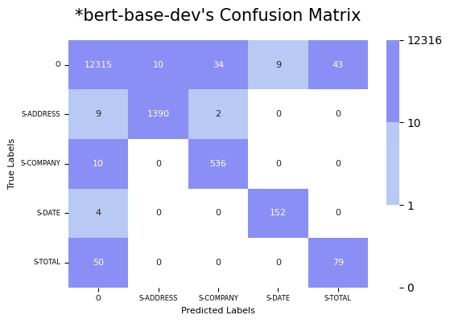

# Baseline 오답 분석
baseline이 틀리는 샘플이 무엇이고, 이들의 특징이 무엇인지 파악합니다\
이런 오답을 보완할 수 있는 아이디어를 제안합니다

<br/>

## 목차

- **모델이 잘 풀지 못하는 데이터**

    - dev 데이터셋에 대한 Confusion matrix로 모델별 장단점 파악
    
    - 특히 공통적으로 잘 못맞추는 `TOTAL`라벨을 보완하기 위한 `TOTAL` 데이터 분석
        - 잘 맞추는 `TOTAL`데이터 공통적인 특징
        - 잘 못맞추는 `TOTAL`데이터 공통적인 특징
        - 나머지 `TOTAL`데이터 공통적인 특징
        - 모든 `TOTAL`데이터 공통적인 특징

<br/>

- **앞으로의 개선 방향 아이디어**

    - 왜 `TOTAL` 데이터를 잘 맞추지 못할까?
    - `TOTAL`을 잘 맞추기 위한 개선 방향


<br/>
<br/>


## 모델이 잘 풀지 못하는 데이터

아래의 모델에 대해 모델이 잘 풀지 못하는 데이터를 파악합니다

| Model | F1 | em | em_no_space | #Parameters | steps |
| --- | --- | --- | --- | --- | --- |
| `google-bert/bert-base-uncased` | 0.8142 | 46.18 | 46.18 | 110M | 600 |
| `microsoft/layoutlm-base-uncased` | **0.8277** | 50.36 | 50.36 | 113M | 600 |
| `microsoft/layoutlm-large-uncased` | **0.8506** | 49.63 | 49.63 | 343M | 600 |

<br/>

### | dev 데이터셋에 대한 Confusion matrix로 모델별 장단점 파악

<br/>

| Model | F1 | em | em_no_space | #Parameters | steps |
| --- | --- | --- | --- | --- | --- |
| `google-bert/bert-base-uncased` | 0.8142 | 46.18 | 46.18 | 110M | 600 |

<br/>



- bert-base의 경우 `S-ADDRESS`와 `S-DATE` 라벨을 잘 맞춥니다
- `S-COMPANY`라벨의 경우 실제로는 `O`인 라벨을 `S-COMPANY`로 잘못 예측하는 샘플이 `34`개 존재합니다
- `TOTAL`라벨의 경우 절반 이상을 틀립니다

<br/>
<br/>

| Model | F1 | em | em_no_space | #Parameters | steps |
| --- | --- | --- | --- | --- | --- |
| `microsoft/layoutlm-base-uncased` | **0.8277** | 50.36 | 50.36 | 113M | 600 |

<br/>


- bert-base와 비슷한 수준으로 `S-ADDRESS`와 `S-DATE` 라벨을 잘 맞춥니다
- bert-base에 비해 `S-COMPANY`에 대한 성능이 보완되었습니다
- `TOTAL`라벨의 경우 bert-base에 비해 틀린 개수가 `93`개 → `67`개로 확연하게 줄어든 것을 볼 수 있습니다
    - 하지만, 여전히 `TOTAL`라벨에 대한 성능은 개선이 필요합니다

<br/>
<br/>

| Model | F1 | em | em_no_space | #Parameters | steps |
| --- | --- | --- | --- | --- | --- |
| `microsoft/layoutlm-large-uncased` | **0.8506** | 49.63 | 49.63 | 343M | 600 |

<br/>


- bert-base와 비슷한 수준으로 `S-ADDRESS`와 `S-DATE` 라벨을 잘 맞춥니다
- layoutlm-base에 비해 `S-COMPANY`에 대한 성능이 보완되었습니다 (틀린 개수 `28`개 → `19`개 )
- `TOTAL`라벨의 경우 layoutlm-base와 비슷한 성능을 보입니다
    - 여전히 `TOTAL`라벨에 대한 성능은 개선이 필요한 것은 마찬가지 입니다


<br/>

## 특히 공통적으로 잘 못맞추는 `TOTAL`라벨을 보완하기 위한 `TOTAL` 데이터 분석

가장 성능이 좋은 `microsoft/layoutlm-large-uncased`를 선택합니다

잘 맞추는 `TOTAL`데이터, 잘 못맞추는 `TOTAL`데이터 특징 정성 분석을 진행합니다

dev 데이터는 **126개**의 샘플로 이루어져 있습니다

실제 모델 학습시, 각 word의 첫번째 Token이 라벨을 예측하고 나머지 Token은 [PAD]를 예측하도록 구성되어 있으므로 \
**첫번째 Token**이 무엇인지 확인합니다

f1-score의 특성상 f1-score가 0인 경우는 precision 혹은 recall이 0 이거나, 둘 다 0인 경우입니다

<br/>

< 아래와 같은 흐름으로 `TOTAL` 데이터를 파악합니다 >

- 잘 맞추는 `TOTAL`데이터 공통적인 특징
- 잘 못맞추는 `TOTAL`데이터 공통적인 특징
- 나머지 `TOTAL`데이터 공통적인 특징
- 모든 `TOTAL`데이터 공통적인 특징

<br/>

### | `TOTAL` 라벨을 완전히 맞춘 경우 `TOTAL`을 이루는 단어의 공통된 특징 분석
```
예시)
    file_name :  X51006389888
    words :  ['52.10']
    first_token :  ['52', '.', '10'] -> 52

    file_name :  X51006414631
    words :  ['$7.00']
    first_token :  ['$', '7', '.', '00'] -> $

    file_name :  X51008030565
    words :  ['7.80']
    first_token :  ['7', '.', '80'] -> 7

    file_name :  X51005568900
    words :  ['9.90']
    first_token :  ['9', '.', '90'] -> 9

    file_name :  X51008063849
    words :  ['2.70']
    first_token :  ['2', '.', '70'] -> 2
```

#### Summary

- `126`개의 샘플 중에 `83`개의 샘플에서 정답을 완전히 맞췄습니다
- 하지만, `TOTAL`라벨을 구성하는 단어의 개수(support의 개수)가 작아 조금이라도 틀리는 순간 f1-score가 급격하게 하락합니다

#### 공통적인 특징

- 모두 `소숫점 둘째 자리`까지의 숫자로 구성됩니다
    
- 간혹 앞에 `화폐 단위`인 `$(United States Dollar)`나 `RM(Ringgit Malaysia)`가 공백없이 붙습니다

- 실제 모델이 라벨 예측을 진행하는 `첫 번째 Token`만 확인했을 때에는, `1-3자리 숫자`, 또는 `화폐 단위`가 사용됩니다

- 코드는 [analysis_error.ipynb](../data_analysis/analysis_error.ipynb)에서 확인해볼 수 있습니다

<br/>

### | `TOTAL` 라벨을 완전히 틀린 경우 `TOTAL`을 이루는 단어의 공통된 특징 분석
```
예시)
    file_name :  X51005757235
    words :  ['31.00']
    first_token :  ['31', '.', '00'] -> 31

    file_name :  X51005719902
    words :  ['25.15']
    first_token :  ['25', '.', '15'] -> 25

    file_name :  X51005745249
    words :  ['RM22.65']
    first_token :  ['rm', '##22', '.', '65'] -> rm

    file_name :  X51006387953
    words :  ['RM1.00']
    first_token :  ['rm', '##1', '.', '00'] -> rm

    file_name :  X51005712021
    words :  ['26.82']
    first_token :  ['26', '.', '82'] -> 26
```
#### summary

- `126개`의 dev 샘플중에 총 `32개` 존재합니다

#### 공통적인 특징

- 완전히 맞추는 `TOTAL`과의 차이점은 `$`가 완전히 틀리는 `TOTAL`에는 없다는 점 입니다
    - 즉, 모델이 `$`가 `TOTAL`임을 학습했다는 뜻입니다
    
- 그에 반해 동일한 화폐 단위인 `rm`은 완전히 맞추기도 하고 완전히 틀리기도 합니다 
    - 이는, 문장 내에 다른 `rm` Token 이 존재하여 예측을 방해하고 있지는 않은지 확인해볼 필요가 있습니다

<br/>

### | 나머지 11개(126-83-32) `TOTAL` 데이터를 확인합니다
```
    file_name :  X51006619343
    words :  ['RM', '22.90']
    first_token :  ['rm'] -> rm

    file_name :  X51008128065
    words :  ['19.90']
    first_token :  ['19', '.', '90'] -> 19

    file_name :  X51005676549
    words :  ['39.75']
    first_token :  ['39', '.', '75'] -> 39

    file_name :  X51007103639
    words :  ['RM', '15.40']
    first_token :  ['rm'] -> rm

    file_name :  X51007339094
    words :  ['35.0000']
    first_token :  ['35', '.', '000', '##0'] -> 35

    file_name :  X51005361883
    words :  ['4.90']
    first_token :  ['4', '.', '90'] -> 4

    file_name :  X51005685355
    words :  ['5.30']
    first_token :  ['5', '.', '30'] -> 5

    file_name :  X51006008091
    words :  ['9.90']
    first_token :  ['9', '.', '90'] -> 9

    file_name :  X51005712039
    words :  ['9.00']
    first_token :  ['9', '.', '00'] -> 9

    file_name :  X51005361907
    words :  ['153.35']
    first_token :  ['153', '.', '35'] -> 153

    file_name :  X00016469619
    words :  ['60.30']
    first_token :  ['60', '.', '30'] -> 60
```

#### 공통적인 특징

- 나머지도 마찬가지로 `1-3` 숫자로 이루어져 있고, `rm`도 2개 존재합니다

    - `$` Token은 모두 `TOTAL`이라는 정답을 맞췄으므로 모델이 `TOTAL`로 제대로 예측해낸다고 볼 수 있습니다
        - 이는 `recall` 점수가 `1`이라는 뜻이지, `precision`은 낮을 수 있습니다
    
<br/>

### 모든 `TOTAL`의 공통적인 특징

- 입력으로 사용되는 가장 첫번째 숫자 Token만 보았을 때, 그 범위가 `200이하의 정수`입니다 (이상치로 1,007.50 가 존재합니다)

- 숫자는 이상치(35.0000)를 제외하고 `소수 둘째자리`로 끝납니다

<br/>
<br/>


## 앞으로의 개선 방향 아이디어

### 왜 `TOTAL` 데이터를 잘 맞추지 못할까?

#### 1. word 속에 숫자가 너무 많다

- `TOTAL` 데이터의 공통적인 특징 측면에서 보았을 때, 모델이 `TOTAL` 데이터를 잘 맞추지 못하는 이유는 다음과 같이 유추해볼 수 있습니다
    
    - word 속에 숫자가 많이 존재하고 그 숫자를 Tokenizing 했을 때의 첫번째 Token이 `TOTAL`라벨에 해당하는 숫자의 첫번째 Token과 동일할 경우 \
    모델은 정확하게 어떤 값이 `TOTAL`인지 구분하기가 힘들것입니다

        -> 이 가설을 확인하기 위해 `TOTAL`라벨이 아니지만 `TOTAL`과 같은 특징을 가지는 word 속 다른 숫자가 존재하는지 확인합니다
        
        -> 더 나아가, 그런 숫자들 속에서 `TOTAL` 라벨이 가지는 특징을 새롭게 찾습니다

<br/>

#### 2. word 속에 `TOTAL` 라벨이 아닌 `rm` Token이 존재한다

- 위의 오답 분석을 통해 `rm`이라는 화폐 단위가 붙을 경우 `TOTAL`이라고 맞추는 경우도 있고 그렇지 않은 경우도 존재함을 확인했습니다

    - word 속에 `TOTAL`라벨이 아닌 `rm`으로 쪼개지는 첫번째 Token이 있는지 확인합니다
        
        -> 만약 존재한다면, `TOTAL`라벨의 `rm`과 다른 `rm`간의 차이점을 찾습니다

<br/>
<br/>

### | `TOTAL`라벨이 아니지만 `TOTAL`과 같은 특징을 가지는 word 속 다른 숫자가 존재하는지 확인합니다

- word 속에 숫자가 많이 존재하고 그 숫자를 Tokenizing 했을 때의 첫번째 Token이 `TOTAL`라벨에 해당하는 숫자의 첫번째 Token과 동일할 경우 \
    모델은 정확하게 어떤 값이 `TOTAL`인지 구분하기가 힘들것입니다

    -> 이 가설을 확인하기 위해 `TOTAL`라벨이 아니지만 `TOTAL`과 같은 특징을 가지는 word 속 다른 숫자가 존재하는지 확인합니다
        
    -> 더 나아가, 그런 숫자들 속에서 `TOTAL` 라벨이 가지는 특징을 새롭게 찾습니다

```
예시)

file_name :  X51005337872
TOTAL word :  ['54.50']
TOTAL first_token :  ['54', '.', '50'] -> 54
common word with TOTAL first token:  ['122', '75', '22', '47', '03', '81', '00', '06', '12', '2', '7', '14', '1', '12', '12', '1', '12', '12', '2', '2', '4', '1', '11', '11', '7', '51', '51', '0', '3', '0', '54']

file_name :  X51006555817
TOTAL word :  ['24.83']
TOTAL first_token :  ['24', '.', '83'] -> 24
common word with TOTAL first token:  ['3', '23', '03', '55', '55', '000', '77', '25', '4', '6', '15', '25', '12', '2', '5', '10', '0', '2', '5', '2', '0', '3', '8', '2', '4', '0', '0', '4', '11', '0', '9', '0', '10', '0', '0', '10', '7', '0', '10', '0', '0', '10', '7', '6', '14', '0', '6', '15', '0', '9', '24']

file_name :  X51006008089
TOTAL word :  ['41.00']
TOTAL first_token :  ['41', '.', '00'] -> 41
common word with TOTAL first token:  ['113', '001', '8', '7', '03', '27', '21', '100', '31', '146', '2', '1', '2', '3', '2', '7', '29', '5', '40', '0', '41', '10', '6', '0', '33', '5', '6', '2', '0']

file_name :  X51006414431
TOTAL word :  ['$7.10']
TOTAL first_token :  ['$', '7', '.', '10'] -> $
common word with TOTAL first token:  ['03', '18', '12', '7', '1', '3', '1', '6', '0']

file_name :  X51005757235
TOTAL word :  ['31.00']
TOTAL first_token :  ['31', '.', '00'] -> 31
common word with TOTAL first token:  ['55', '00', '137', '1', '000', '15', '1', '000', '15', '31', '31', '31', '50', '2', '6', '29', '1', '29', '1', '09', '18', '100', '001', '001', '03', '1', '19']
```

- 샘플 속에서 `TOTAL`라벨을 제외하고 `TOTAL`의 공통적인 특징(200이하의 정수, 소수 둘째자리 숫자)을 띠는 word가 존재하는지 확인합니다

    - 만약 없다면, 입력으로 들어오는 텍스트에 대해 이 **공통적인 특징을 가지는 word**일 때, 모델이 잘 푸는 `$`를 붙여준다면 `TOTAL`을 더 잘 맞추게 될 것입니다

        -> 아쉽게도 존재하는 것을 확인했습니다 

- **공통적인 특징**
    - **주로 맨 뒤**에 위치하는 경우가 많았지만, 그렇지 않은 경우도 존재하기에 이 정보를 활용할 수 없습니다

    - **이 이외에 `TOTAL` 라벨만이 가지는 특징은 확인하기 어렵습니다**

<br/>
<br/>


### | word 속에 `TOTAL`라벨이 아닌 `rm`으로 쪼개지는 첫번째 Token이 있는지 확인합니다

- 위의 오답 분석을 통해 `rm`이라는 화폐 단위가 붙을 경우 `TOTAL`이라고 맞추는 경우도 있고 그렇지 않은 경우도 존재함을 확인했습니다

    - word 속에 `TOTAL`라벨이 아닌 `rm`으로 쪼개지는 첫번째 Token이 있는지 확인합니다
        
        -> 만약 존재한다면, `TOTAL`라벨의 `rm`과 다른 `rm`간의 차이점을 찾습니다

```
file_name :  X51005745249
TOTAL word :  ['RM22.65']
TOTAL first_token :  ['rm', '##22', '.', '65'] -> rm
Another `rm` in words :  ['RM0.20', 'RM11.90', 'RM11.90', '-RM0.01', 'RM24.00', 'RM30.00', 'RM6.00', 'RM1.36', 'RM22.65']

file_name :  X51006387953
TOTAL word :  ['RM1.00']
TOTAL first_token :  ['rm', '##1', '.', '00'] -> rm
Another `rm` in words :  ['RM1.00', 'RM1.00', 'RM0.00', 'RM1.00', 'RM0.94', 'RM0.06']

file_name :  X51007846309
TOTAL word :  ['RM6.00']
TOTAL first_token :  ['rm', '##6', '.', '00'] -> rm
Another `rm` in words :  ['RM1.03', 'RM1.88', 'RM4.12', 'RM1.88', 'RM6.00', 'RM0.00', 'RM6.00', 'RM6.00', 'RM0.00', 'AMOUNT(RM)', 'TAX(RM)', 'RICE@PERMAS']

file_name :  X51006619545
TOTAL word :  ['RM111.90']
TOTAL first_token :  ['rm', '##11', '##1', '.', '90'] -> rm
Another `rm` in words :  ['(RM)', 'RM111.90', ':RM', 'RM5.33', 'CC*7185:RM111.90', 'AMT(RM)', 'TAX(RM)', 'INVOICE.(TERMS', '(RM)']

file_name :  X51006619343
TOTAL word :  ['RM', '22.90']
TOTAL first_token :  ['rm'] -> rm
Another `rm` in words :  ['RM', 'RM', 'RM', 'RM']

file_name :  X51007846388
TOTAL word :  ['RM8.20']
TOTAL first_token :  ['rm', '##8', '.', '20'] -> rm
Another `rm` in words :  ['RM6.69', 'RM1.50', 'RM6.69', 'RM1.50', 'RM8.19', 'RM0.00', 'RM0.01', 'RM8.20', 'RM8.20', 'RM0.00', 'AMOUNT(RM)', 'TAX(RM)', 'RICE@PERMAS']

file_name :  X51007103639
TOTAL word :  ['RM', '15.40']
TOTAL first_token :  ['rm'] -> rm
Another `rm` in words :  ['RM', 'RM', 'RM']

file_name :  X51007103578
TOTAL word :  ['RM', '31.20']
TOTAL first_token :  ['rm'] -> rm
Another `rm` in words :  ['RM', 'RM', 'RM']

file_name :  X51005719883
TOTAL word :  ['RM108.50']
TOTAL first_token :  ['rm', '##10', '##8', '.', '50'] -> rm
Another `rm` in words :  ['RM108.50', 'RM', 'RM', 'RM', '(RM)', 'TAX(RM)']

file_name :  X51005444045
TOTAL word :  ['RM11.40']
TOTAL first_token :  ['rm', '##11', '.', '40'] -> rm
Another `rm` in words :  ['RM11.40', 'RM', 'RM', 'RM', 'AMOUNT(RM)', 'TAX(RM)']
```

- **공통적인 특징**

    - 확인 결과, `TOTAL`라벨의 `rm`만이 가지는 공통적인 특징을 확인하기 어렵습니다

    - `TOTAL`에 해당하는 `rm`의 위치가 맨 앞인 경우도 있고, 맨 뒤에 있는 경우도 존재하여 추가적인 순서 정보를 통한 성능 향상은 어렵습니다

<br/>
<br/>

## `TOTAL`을 잘 맞추기 위한 앞으로의 개선 방향

- 오답 분석을 통해 텍스트 관점에서 `TOTAL` 라벨에 해당하는 word가 가지는 특징을 추출해내어\
그러한 word에 한해 모델 학습에 도움이 될 수 있는 화폐 단위 Token(`$`)을 추가해보고자 하였습니다

- 하지만, 텍스트 관점에서 `TOTAL` 라벨에 해당하는 word가 가지는 특징을 확인하기 어려웠습니다

<br/>

- 즉, `텍스트 관점`이 아닌 `이미지 관점`에서 `TOTAL` 라벨에 대한 정보를 추가적으로 제공해주는 것이 좋아보입니다

    - 텍스트와 layout(이미지내 텍스트의 상대 위치) 뿐 아니라 실제 이미지에서 `글씨의 굵기`, `폰트`, `색깔` 등의 정보를 사용하여 `TOTAL`에 해당하는 특징을 찾아보고자 합니다
    
    - 이런 시도들이 담긴 LayoutLMV2, LayoutLMV3을 분석하고 구현하고 장단점을 비교해보겠습니다