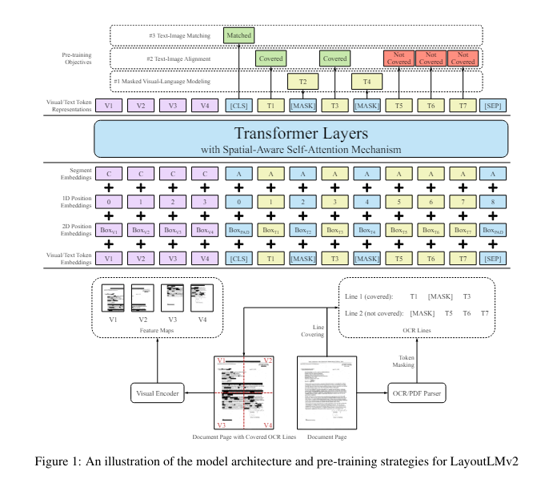

# LayoutLMV2 
LayoutLMV2를 정리하고 결과를 분석합니다

<br/>

## 목차

- **Quick Review of LayoutLM**
    - Overview
    - Fine-tuning Method

- **LayoutLMV2란?**
    - Overview
    - `LayoutLM`과의 차이점
    - Fine-tuning Method

- **결과**
    - Fine-tuning Setting
        - Dataset
        - hyperparameters

    - `LayoutLM` vs `LayoutLMV2`
        - 간단한 오답 비교

- **결과 기반 모델 고도화 전략**

- **References**

<br/>
<br/>

## Quick Review of LayoutLM

### | Overview
> 한 줄 요약 : 이미지에서 추출된 텍스트가 주어질 경우, 텍스트만 사용하지 말고 이미지도 사용하자!
- **구조** : Transformer Encoders

- **Model Architecture**


- **사전학습**
    - 방식 
        - **Masked Visual-Language Model(MVLM)**
            - 특정 Token을 Masking 한 후, 맥락(context)와 해당 Token의 이미지상 2D 위치정보를 활용해\
        Masking된 Token을 복원하는 방식으로 학습합니다

        - **Multi-label Document Classification(MDC)** *(optional)*
            - Document Image별 Multiple Tag를 [CLS] 토큰의 최종 출력을 이용해 예측하도록 학습합니다

    - 데이터 
        - **IIT-CDIP Test Collection 1.0**
            - 구성 : 스캔된 Image, OCR을 통해 얻은 Document, 추가적인 Metadata\
            - Scale : 6M Scanned Documents + 11M Scanned Document Images\
            - Metadata : [ Title, Organization Authors, Person Authors,  Document Date, Document Type, Bates Number, Page Count, collection ]

- **Tokenizer** : [WordPiece](https://arxiv.org/abs/1609.08144)
- **선정 모델** : [`microsoft/layoutlm-base-uncased`](https://huggingface.co/microsoft/layoutlm-base-uncased), [`microsoft/layoutlm-large-uncased`](https://huggingface.co/microsoft/layoutlm-large-uncased)
- **소개 논문** : [LayoutLM: Pre-training of Text and Layout for Document Image Understanding](https://arxiv.org/abs/1912.13318)

<br/>

### | Fine-tuning Method

- **두 가지 타입의 임베딩을 준비하고 모두 더하여 사용합니다**

    - Text Embedding(Text Embedding + Positional Embedding + Segment Embedding)

    - Bounding box Position Embedding(x0,y0,x1,y1,width,height)
        - (x0,y)0는 Text Bounding box의 왼쪽 상단 좌표, (x1,y1)는 Text Bounding box의 오른쪽 하단 좌표입니다
        - width, height는 Text Bounding box의 width, height입니다

    - 구현된 코드는 아래와 같습니다
    ```
        # https://github.com/huggingface/transformers/blob/v4.41.0/src/transformers/models/layoutlm/modeling_layoutlm.py#L50

        embeddings = (
            words_embeddings
            + position_embeddings
            + left_position_embeddings
            + upper_position_embeddings
            + right_position_embeddings
            + lower_position_embeddings
            + h_position_embeddings
            + w_position_embeddings
            + token_type_embeddings
            )
    ```

- **사전학습된 LayoutLM에 전달합니다**

    - **각 Token별 사전학습된 LayoutLM의 출력 벡터를 가지고 Downstream Task를 풉니다**
        - 사전학습된 CNN 모델을 통한 각 Bounding box에 해당하는 이미지를 벡터화 시켜 각 Token에 추가로 더하여 사용할 수도 있습니다
        - 하지만, 이미지와 텍스트간의 alignment가 Layoutlm에 사전학습되지는 않은 상태입니다


<br/>
<br/>

## LayoutLMV2란?


### | Overview
> 한 줄 요약 : LayoutLM처럼 이미지를 활용하는데, 이를 사전학습에 참여시켜 이미지-텍스트간 Alignment를 높이자!
- **구조** : Transformer Encoders

- **Model Architecture**




- **사전학습**
    - 방식 
        - **Masked Visual-Language Model(MVLM)**
            - 특정 Token을 Masking 한 후, `맥락(context)`와 해당 Token의 `이미지상 2D 위치 정보`, 이제는 `이미지 정보`까지 활용해\
        Masking된 Token을 복원하는 방식으로 학습합니다
            - 이때, Image Embedding으로 부터 Text 정보를 훔쳐보면 안되기 때문에\
            Masking된 Token에 해당하는 문서 이미지 영역을 Visual Encoder를 통과하기 전에 마스킹합니다

        - **Text-Image Alignment**
            - 서로 다른 두 모델로 부터 얻어낸 Text 벡터와 Image 벡터를 사전학습에 사용하기 때문에 \
            이 두 벡터간의 Alignment를 위해 아래 두 가지 Text-Image Alignment Task가 사전학습에 사용됩니다

            - **Fine-grained Cross-modality Aligment Task**
                - 이미지에서 특정 토큰을 랜덤하게 마스킹 한 후, \
                텍스트 Token에서 해당 Token이 이미지에서 가려져 있는 Token인지 그렇지 않은지 예측합니다
                - MVLM 단계에서 마스킹되었는지는 고려하지 않습니다

            - **Coarse-grained Cross-modality Alignment Task**
                - 입력으로 함께 주어진 이미지와 텍스트가 같은 문서로부터 나온 것인지 이진 분류합니다
                - 이를 통해 문서 이미지 전체와 텍스트간의 대응 관계를 학습할 수 있게 됩니다
                - 서로 다른 문서에 해당하는 Negative Sample의 경우 (15%)는 랜덤하게 교체한 이미지, (5%)는 이미지를 사용하지 않습니다
            

    - 데이터 
        - **IIT-CDIP Test Collection 1.0**
            - 구성 : 스캔된 Image, OCR을 통해 얻은 Document, 추가적인 Metadata
            - Scale : 6M Scanned Documents + 11M Scanned Document Images
            - Metadata : [ Title, Organization Authors, Person Authors,  Document Date, Document Type, Bates Number, Page Count, collection ]

- **Tokenizer** : [WordPiece](https://arxiv.org/abs/1609.08144)
- **선정 모델** : [`microsoft/layoutlmv2-base-uncased`](https://huggingface.co/microsoft/layoutlmv2-base-uncased), [`microsoft/layoutlmv2-large-uncased`](https://huggingface.co/microsoft/layoutlmv2-large-uncased)
- **소개 논문** : [LayoutLMv2: Multi-modal Pre-training for Visually-rich
Document Understanding](https://arxiv.org/abs/2012.14740)

<br/>

### | LayoutLM과의 차이점

- `LayoutLM`에서도 downstream Task Fine-tuning시에 이미지 정보를 사용할 수 있지만, \
    이미지 정보가 Pretraining에 직접적으로 관여한 것이 아니기 때문에 `텍스트 임베딩`과 `이미지 임베딩` 사이의 Alignment를 맞추는 것이 어렵습니다

- 이를 보완하기 위해, LayoutLMV2에서는 Pretraining시 입력의 앞단에 `이미지 임베딩`을 넣어 `텍스트 임베딩과의 Attention이 가능`하도록 구성합니다

- 입력으로 들어간 `이미지 임베딩`(Using pretrained-CNN)과 `텍스트 임베딩`(Using Embedding Layer)은 일단은 서로 다른 모델로 부터 얻은 것이기 때문에\
     이 두 벡터간의 Alignment를 모델이 학습하기 위해 앞서 설명한 사전학습을 추가적으로 수행합니다
    
    - 이미지 토큰을 Masking 했을 때, 텍스트 토큰에서 이를 알아차릴 수 있도록 하는 부분 (이미지 토큰과 텍스트 토큰간의 연관성 학습)

    - 입력으로 주어진 이미지가 현재 텍스트가 추출된 이미지인지 알아차릴 수 있도록 하는 부분 (이미지와 텍스트간의 전반적인 연관성 학습)

<br/>

### | Fine-tuning Method
- 3가지 타입의 임베딩이 사용됩니다
    - **Text Embedding**(Text Embedding + Positional Embedding + Segment Embedding)

    - **Bounding box Position Embedding**(x0,y0,x1,y1,width,height)
        - (x0,y0)는 Text Bounding box의 왼쪽 상단 좌표, (x1,y1)는 Text Bounding box의 오른쪽 하단 좌표입니다
        - width, height는 Text Bounding box의 width, height입니다

    - **Image Embedding**
        - Document page image를 ( 3 x 224 x 244 ) 크기로 normalize합니다 (3은 BGR channel입니다)
        - CNN-based Visual Encoder(ResNeXt-FPN)의 output feature map을 Average Pooling하여 ( 7 x 7 ) 크기의 고정된 output으로 반환합니다
        - ( 7 x 7 ) feature를 Flatten시켜 `49개`의 Visual Embedding Sequence를 만듭니다
        - 여기에 Positional Embedding(각 Token의 순서정보), Segment Embedding(이미지와 텍스트의 분리 정보)을 더합니다
        - 자세한 코드 내용은 다음 [링크](https://github.com/huggingface/transformers/blob/v4.41.0/src/transformers/models/layoutlmv2/image_processing_layoutlmv2.py#L95)에서 확인하실 수 있습니다

    - **최종 Text Embedding**

        - LayoutLM에서는 각 Token에 대해 Text Embedding과 Bounding box Embedding을 그냥 더했지만, \
        LayoutLMV2에서는 Text Embedding의 차원을 768이라고 했을 때,\
         6개의 Bounding Box Postion Embedding의 각 차원은 128차원으로 만들고 이 6개를 concat하여 768(128*6) 차원으로 만든 후, \
         Text Embedding과 더합니다
            - 이때, (x0, x1, width)끼리 (y0, y1, hight)끼리 같은 임베딩 layer를 사용합니다
    
        - 자세한 코드 내용은 다음 [링크](https://github.com/huggingface/transformers/blob/v4.41.0/src/transformers/models/layoutlmv2/modeling_layoutlmv2.py#L78)에서 확인하실 수 있습니다
    
    - **최종 Input Token Sequence**
        - 최종적으로 모델의 앞단에 `49`개의 이미지 Token이 들어가게 되고,\
        이에 이어서 텍스트 Token이 Max_seuqence_length(`512`)만큼 들어갑니다
        - 결국 최종 max_sequence_length는 `561`개가 됩니다

    - 마지막으로, 이를 사전학습된 LayoutLMV2에 전달합니다

        - 각 Token별 사전학습된 LayoutLMV2의 출력 벡터를 가지고 Downstream Task를 풉니다

<br/>
<br/>

## 결과

### | Fine-tuning Setting

#### Dataset
- 앞서 train과 dev 데이터를 나눴을 때, image도 같이 나누도록 구성하여 학습에 사용하였습니다

#### hyperparameters
- learning_rate : 5e-5
- max_sequence_length : 512
- seed : 42
- batch_size : 8

<br/>

### | `LayoutLM` vs `LayoutLMV2`

#### 성능 비교

| Model | F1 | em | em_no_space | #Parameters | steps |
| --- | --- | --- | --- | --- | --- |
| `microsoft/layoutlm-base-uncased` | 83.51 | 50.79 | 50.79 | 113M | 800 |
| `microsoft/layoutlm-large-uncased` | 86.95 | 51 | 51 | 343M | 800 |
|`microsoft/layoutlmv2-base-uncased` | **84.18** | 52.73 | 52.73 | 200M | 800 |
|`microsoft/layoutlmv2-large-uncased` | **88.5** | 53.67 | 53.67 | 426M | 800 |

- 모델별 성능은 위와 같습니다
- base와 large 모두 op_test데이터에 대해 1-2점 정도 성능 향상을 보이는 것을 볼 수 있습니다

<br/>

#### 간단한 오답 비교

가장 큰 문제였던 `TOTAL`라벨에 대한 문제가 `bounding box의 이미지 정보`를 추가함에 따라 dev 데이터셋에 대해 더 잘 구분하는지 확인해봅니다

**< base-model >**


- True Positive(라벨에 맞는 정답을 맞춘 개수)의 개수(`98개`)는 layoutlm이 더 많습니다
- layoutlmv2로 넘어감에 따라 False Positive(예측했지만 틀린 경우)의 개수(`36` → `26`)가 확연하게 줄어들었습니다
- 여전히 틀리는 것이 많은 라벨은 `COMPANY`와 `TOTAL` 입니다
 
<br/>

**< large-model >**


- True Positive(라벨에 맞는 정답을 맞춘 개수)가 `O`를 제외하고 모든 면에서 좋아졌습니다
- 특히, 문제였던 `TOTAL`에 대한 True Postive가 `129`개의 샘플 중에서 무려 `102`개를 맞추면서\
텍스트와 bounding box 레이아웃에 더하여 bounding box의 이미지 feature를 제공하는 것이\
`TOTAL`을 맞추는데 큰 도움을 주는 것을 볼 수 있습니다
- 여전히 틀리는 것이 많은 라벨은 `COMPANY`와 `TOTAL` 입니다

<br/>
<br/>

## 결과 기반 모델 고도화 전략
- 텍스트와 bounding box 레이아웃에 더하여 bounding box의 이미지 feature를 추가함에 따라 문제였던 `TOTAL`라벨에 대한 문제가 크게 개선됨을 확인했습니다

### | 이유 분석
- 그 이유를 정성분석 해보자면 다음과 같습니다

    - **`TOTAL` 라벨은 최종 가격이기 때문에 굵은(Bold)글씨인 경우가 많다!**

    

    - 실제로 dev 데이터를 확인해본 결과 많은 이미지들의 `TOTAL` 값이 **굵은(Bold) 글씨**로 적혀있는 것을 확인했습니다
    - 이런 정보가 이미지 feature 벡터 내에 포함되면서 모델이 `TOTAL` 값을 예측하는데 도움을 준 것으로 추측됩니다


<br/>

### | 앞으로의 모델 고도화 전략
- LayoutLMV2의 문제인 이미지 벡터를 CNN기반 사전학습된 모델에서 가져오기 때문에 `이미지 벡터`와 `텍스트 벡터`간 Alignment 문제가 존재합니다
    - 이를 해결하기 위해 두 가지 기법의 사전학습 Task를 추가하였지만, 그대로 문제가 완전히 해결되지 않을 가능성이 높습니다

<br/>

#### 1. 위의 LayoutLMV2의 문제를 보완한 **`LayoutLMV3` 모델로 문제를 풀어봅니다!**
- LayoutLMV3는 텍스트 뿐만 아니라 이미지도 하나의 모델 안에서 Masking한 후 복원하는 사전학습을 수행합니다
- 추가적으로 각 텍스트와 이미지를 복원하는 것 만으로는 텍스트와 이미지의 Alignment를 학습하기에는 부족하므로\
특정 Text에 대응되는 이미지 patch가 마스킹 되었는지, 그렇지 않은지를 이진 분류 하는 학습을 추가로 진행합니다

<br/>
<br/>


< `TOTAL`과 `COMPANY`를 해결해보자! >

#### 2.  `TOTAL`에 해당하는 token의 위치는 `TOTAL 이라는 Text`의 오른쪽에 올 가능성이 매우 높습니다!
- `TOTAL`에 해당하는 token의 위치는 `TOTAL이라는 Text`의 오른쪽에 올 가능성이 매우 높다는 것에서 착안하여 \
`TOTAL` Token이 Qurey가 되어 Attention을 수행할 때, 그 뒤에 있는 Token들에 보다 집중 할 수 있도록 \
문장 내 첫번째 `TOTAL`을 중심으로 앞 뒤가 나뉘는 Segment Embedding을 추가하여 사전학습해볼 수 도 있습니다

<br/>

- 단순한 방법으로는, Inference 단계에서 `TOTAL`의 Token을 예측 할 때에는 \
앞에 `TOTAL이라는 Text` or `Amount 라는 Text` or `RM 이라는 Text` or `$ 이라는 Text`가 존재할 때에만\
 예측을 해내도록 구성할 수 있습니다

    - 그러기 위해서는 일단, 실제 위의 조건을 만족하는 샘플이 어느정도의 비율이 되는지 통계적으로 확인해봐야 합니다

    - 만약 실제 데이터가 저 조건을 만족한다면, 지금 문제였던 `TOTAL이 아님에도 TOTAL이라고 예측하는 것`\
    즉, **False Postive**(`layoutlmv2-large`에서 `31`개)를 줄여 `TOTAL`의 `Precision` 점수 향상에 도움을 줄 수 있을 것입니다

<br/>


#### 3.  `COMPANY`는 전체 문장의 맨 앞 1-2줄에 대부분 위치합니다!
- `COMPANY`라는 라벨의 위치를 정성분석 해보니 대부분이 맨 앞 1-2줄에 대부분 위치하는 것을 볼 수 있습니다
- 통계적으로 실제 그러한지 확인하고, 만약 그러하다면 이 1-2줄 범위에 없지만 `COMPANY`라고 예측하는 경우를\
Inference 단계에서 막는 다면 `COMAPNY가 아님에도 COMPANY라고 예측하는 것`\
즉, **False Positive**(layoutlmv2-large에서 `38`개)를 줄어 `COMPANY`의 `Precision`점수 향상에 도움을 줄 수 있을 것입니다


## References
- [LayoutLM: Pre-training of Text and Layout for Document Image Understanding](https://arxiv.org/abs/1912.13318)
- [LayoutLMv2: Multi-modal Pre-training for Visually-rich
Document Understanding](https://arxiv.org/abs/2012.14740)