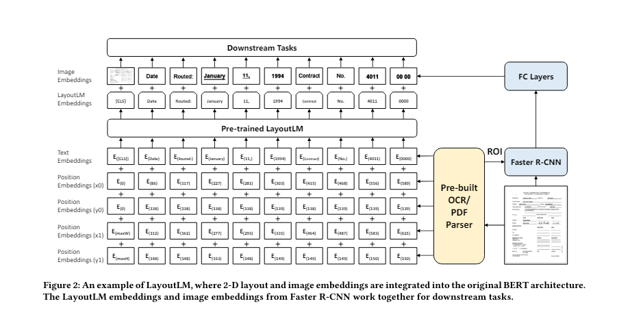
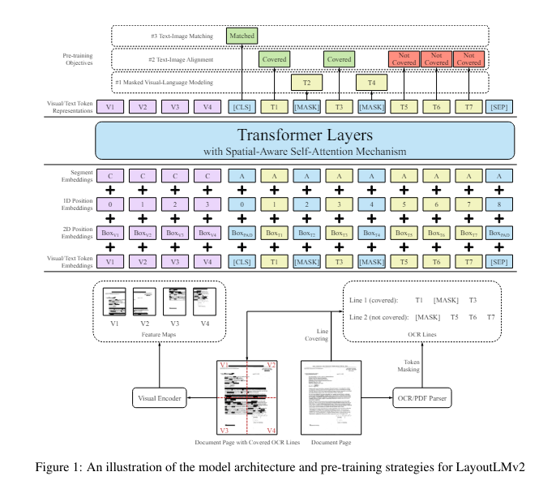
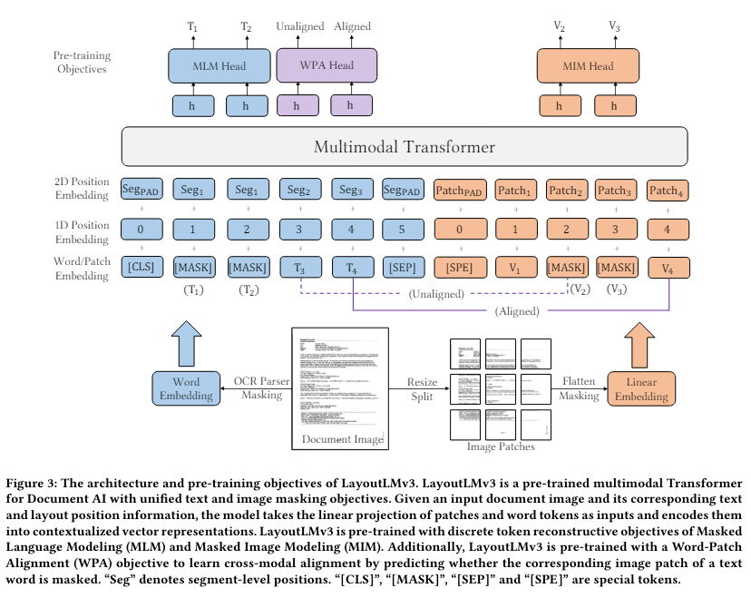
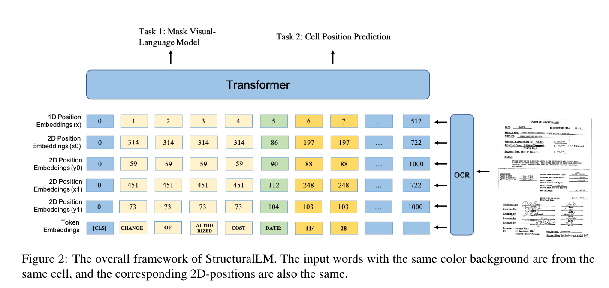
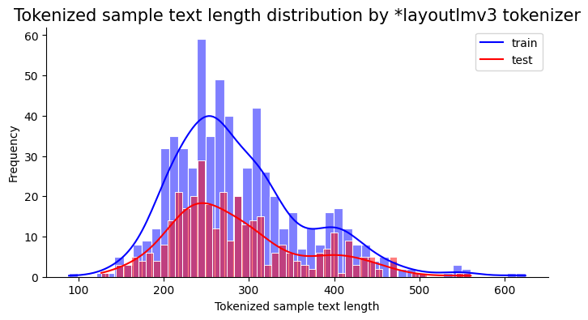
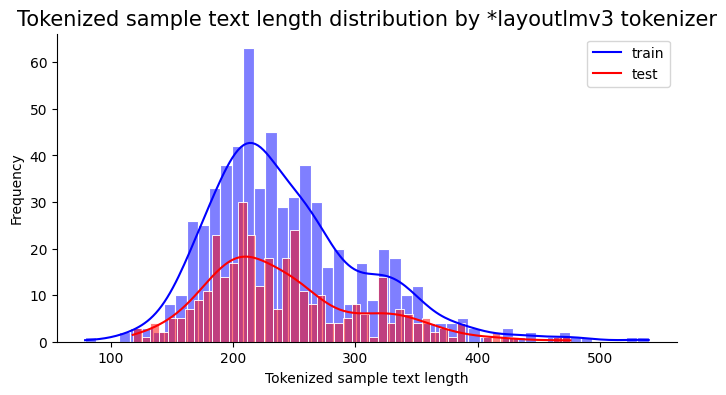
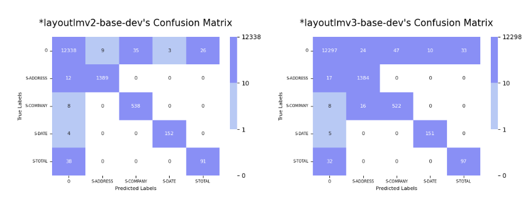
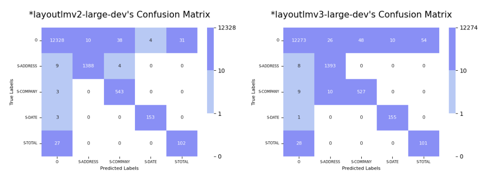

# LayoutLMV3 
LayoutLMV3를 정리하고 결과를 분석합니다
 

## 목차

- **Quick Review of LayoutLM and LayoutLMV2**
    - Overview

- **LayoutLMV3란?**
    - Overview
    - `LayoutLMV2`와의 차이점
    - Fine-tuning Method

- **결과**
    - Fine-tuning Setting
        - Tokenizer 변경에 따른 Input Token 개수 확인
        - `cased` or `uncased`
        - Dataset
        - hyperparameters

    - `LayoutLM2` vs `LayoutLMV3`
        - 간단한 오답 비교

- **결과 기반 모델 고도화 전략**

- **References**

 
 

## Quick Review of LayoutLM and LayoutLMV2

### | LayoutLM
> 한줄 요약 : 이미지에서 추출된 텍스트가 주어질 경우, 텍스트만 사용하지 말고 이미지도 사용하자!
- **구조** : Transformer Encoders

- **Model Architecture**

- **사전학습**
    - 방식 
        - **Masked Visual-Language Model(MVLM)**
            - 특정 Token을 Masking 한 후, 맥락(context)와 해당 Token의 이미지상 2D 위치정보를 활용해\
        Masking된 Token을 복원하는 방식으로 학습합니다

        - **Multi-label Document Classification(MDC)** *(optional)*
            - Document Image별 Multiple Tag를 [CLS] 토큰의 최종 출력을 이용해 예측하도록 학습합니다

    - 데이터 
        - **IIT-CDIP Test Collection 1.0**
            - 구성 : 스캔된 Image, OCR을 통해 얻은 Document, 추가적인 Metadata\
            - Scale : 6M Scanned Documents + 11M Scanned Document Images\
            - Metadata : [ Title, Organization Authors, Person Authors,  Document Date, Document Type, Bates Number, Page Count, collection ]

- **Tokenizer** : [WordPiece](https://arxiv.org/abs/1609.08144)
- **선정 모델** : [`microsoft/layoutlm-base-uncased`](https://huggingface.co/microsoft/layoutlm-base-uncased), [`microsoft/layoutlm-large-uncased`](https://huggingface.co/microsoft/layoutlm-large-uncased)
- **소개 논문** : [LayoutLM: Pre-training of Text and Layout for Document Image Understanding](https://arxiv.org/abs/1912.13318)

- **Fine-tuning Method**에 대해서는 [layoutlm2_results](./layoutlmv2_results.md#fine-tuning-method)에서 자세하게 확인해볼 수 있습니다

 

### | LayoutLMV2

> 한 줄 요약 : LayoutLM처럼 이미지를 활용하는데, 이를 사전학습에 참여시켜 이미지-텍스트간 Alignment를 높이자!

- **구조** : Transformer Encoders

- **Model Architecture**

- **사전학습**
    - 방식 
        - **Masked Visual-Language Model(MVLM)**
            - 특정 Token을 Masking 한 후, `맥락(context)`와 해당 Token의 `이미지상 2D 위치 정보`, 이제는 `이미지 정보`까지 활용해\
        Masking된 Token을 복원하는 방식으로 학습합니다
            - 이때, Image Embedding으로 부터 Text 정보를 훔쳐보면 안되기 때문에\
            Masking된 Token에 해당하는 문서 이미지 영역을 Visual Encoder를 통과하기 전에 마스킹합니다

        - **Text-Image Alignment**
            - 서로 다른 두 모델로 부터 얻어낸 Text 벡터와 Image 벡터를 사전학습에 사용하기 때문에 \
            이 두 벡터간의 Alignment를 위해 아래 두 가지 Text-Image Alignment Task가 사전학습에 사용됩니다

            - **Fine-grained Cross-modality Aligment Task**
                - 이미지에서 특정 토큰을 랜덤하게 마스킹 한 후, \
                텍스트 Token에서 해당 Token이 이미지에서 가려져 있는 Token인지 그렇지 않은지 예측합니다
                - MVLM 단계에서 마스킹되었는지는 고려하지 않습니다

            - **Coarse-grained Cross-modality Alignment Task**
                - 입력으로 함께 주어진 이미지와 텍스트가 같은 문서로부터 나온 것인지 이진 분류합니다
                - 이를 통해 문서 이미지 전체와 텍스트간의 대응 관계를 학습할 수 있게 됩니다
                - 서로 다른 문서에 해당하는 Negative Sample의 경우 (15%)는 랜덤하게 교체한 이미지, (5%)는 이미지를 사용하지 않습니다
            

    - 데이터 
        - **IIT-CDIP Test Collection 1.0**
            - 구성 : 스캔된 Image, OCR을 통해 얻은 Document, 추가적인 Metadata
            - Scale : 6M Scanned Documents + 11M Scanned Document Images
            - Metadata : [ Title, Organization Authors, Person Authors,  Document Date, Document Type, Bates Number, Page Count, collection ]

- **Tokenizer** : [WordPiece](https://arxiv.org/abs/1609.08144)
- **선정 모델** : [`microsoft/layoutlmv2-base-uncased`](https://huggingface.co/microsoft/layoutlmv2-base-uncased), [`microsoft/layoutlmv2-large-uncased`](https://huggingface.co/microsoft/layoutlmv2-large-uncased)
- **소개 논문** : [LayoutLMv2: Multi-modal Pre-training for Visually-rich
Document Understanding](https://arxiv.org/abs/2012.14740)

- **Fine-tuning Method**에 대해서는 [layoutlm2_results](./layoutlmv2_results.md#fine-tuning-method-1)에서 자세하게 확인해볼 수 있습니다

 
 
 

## LayoutLMV3란?

### | Overview
> 한 줄 요약 : 이미지 feature를 사전학습된 CNN 모델로부터 가져오지 않고, 하나의 모델을 가지고 텍스트와 동일한 방식으로 마스킹된 이미지 토큰을 복원하는 방식으로 학습시키자! 
- **구조** : Transformer Encoders

- **Model Architecture**

- **사전학습**
    - 방식 
        - **Masked Language Modeling (MLM) + Masked Image Modeling (MIM) + Word-Patch Alignment (WPA)**
            - 위 3가지 pre-training objectives를 하나로 구성해 사용합니다

            - **Masked Language Modeling (MLM)**
                 - 일부 Tokne을 무작위로 Masking하고 이를 복원하는 사전학습을 수행합니다

            - **Masked Image Modeling (MIM)**
                - [ViT](https://arxiv.org/abs/2010.11929)처럼 이미지를 Patch단위로 쪼개 Token으로 만들고, 일부 Patch Token을 Masking하고 이를 복원하는 사전학습을 수행합니다

            - **Word-Patch Alignment (WPA)**
                - 모델의 입력에서 특정 Text는 특정 Image patch와 대응되게 됩니다
                - 하지만, MLM, MIM 단계에서 Masking이 수행되기 때문에 이 둘간의 alignment를 제대로 학습하기는 어렵습니다
                - 이를 위해, 특정 Text에 대응되는 Image patch가 마스킹 되었는지 그렇지 않은지 이진 분류 문제를 수행합니다
                    - 이를 통해, 특정 Text에 대응하는 Image patch가 무엇인지 모델이 학습하게 됩니다

    - 데이터 
        - **IIT-CDIP Test Collection 1.0**
            - 구성 : 스캔된 Image, OCR을 통해 얻은 Document, 추가적인 Metadata
            - Scale : 6M Scanned Documents + 11M Scanned Document Images
            - Metadata : [ Title, Organization Authors, Person Authors,  Document Date, Document Type, Bates Number, Page Count, collection ]

- **Tokenizer** : [Byte-Pair Encoding(BPE)](https://arxiv.org/abs/1508.07909)
- **선정 모델** : [`microsoft/layoutlmv3-base`](https://huggingface.co/microsoft/layoutlmv3-base), [`microsoft/layoutlmv3-large`](https://huggingface.co/microsoft/layoutlmv3-large)
- **소개 논문** : [LayoutLMv3: Pre-training for Document AI with Unified Text and Image Masking](https://arxiv.org/abs/2204.08387)

 
 

### | `LayoutLMV2`와의 차이점
- Tokenizing 방식
    - WordPiece에서 [Byte-Pair Encoding(BPE)](https://arxiv.org/abs/1508.07909)로 변경합니다

- 2D Postion Embedding을 구하는 기준
    - Word-level Layout Position에서 Segment-level Position으로 2D Position Embedding을 구합니다
    - 즉, 단어 단위로 layout을 달리 가져가는 것이 아니라, 같은 Segment(성격이 같은 영역) 단위로 2D Position Embedding을 가져갑니다

    <[StructuralLM: Structural Pre-training for Form Understanding](https://arxiv.org/abs/2105.11210)>
    
    

 

### | Fine-tuning Method

- 3가지 타입의 임베딩이 사용됩니다
    - **Text Embedding**(Text Embedding + 1D Positional Embedding + Segment Embedding)

    - **Bounding box Position Embedding**(x0,y0,x1,y1,width,height)
        - (x0,y0)는 Text Bounding box의 왼쪽 상단 좌표, (x1,y1)는 Text Bounding box의 오른쪽 하단 좌표입니다
        - width, height는 Text Bounding box의 width, height입니다

    - **Image Embedding**
        - Document page image를 ( 3 x 224 x 244 ) 크기로 normalize합니다 ( 3은 RGB channel입니다 )
        - ( 16 x 16 ) 크기의 patch 단위로 짤라 197개의 patch를 준비합니다
        - 각 patch에 linear embedding을 통해 벡터화하고
        - 여기에 Positional Embedding(각 Token의 순서정보), 2D Positional Embedding(bounding box 위치 정보)을 더합니다
        - 자세한 코드 내용은 다음 [링크](https://github.com/huggingface/transformers/blob/v4.41.0/src/transformers/models/layoutlmv2/modeling_layoutlmv2.py#L740)에서 확인하실 수 있습니다

    - **최종 Text Embedding**

        - LayoutLM에서는 각 Token에 대해 Text Embedding과 Bounding box Embedding을 그냥 더했지만, \
        LayoutLMV2와 LayoutLMV3에서는 Text Embedding의 차원을 768이라고 했을 때,\
         6개의 Bounding Box Postion Embedding의 각 차원은 128차원으로 만들고 이 6개를 concat하여 768(128*6) 차원으로 만든 후, \
         Text Embedding과 더합니다
            - 이때, (x0, x1, width)끼리 (y0, y1, hight)끼리 같은 임베딩 layer를 사용합니다
    
        - 자세한 코드 내용은 다음 [링크](https://github.com/huggingface/transformers/blob/v4.41.0/src/transformers/models/layoutlmv2/modeling_layoutlmv2.py#L78)에서 확인하실 수 있습니다
    
    - **최종 Input Token Sequence**
        - 최종적으로 모델의 앞단에 텍스트 Token이 Max_seuqence_length(`512`)만큼 들어갑니다
        - 이후, 이미지 Patch Token이 patch 개수(`197`)만큼 들어갑니다
        - 결국 최종 max_sequence_length는 `709`개가 됩니다

    - 마지막으로, 이를 사전학습된 LayoutLMV3에 전달합니다

        - 각 Token별 사전학습된 LayoutLMV3의 출력 벡터를 가지고 Downstream Task를 풉니다

 
 

## 결과

### | Fine-tuning Setting

 

#### `cased` or `uncased`
- Tokenizer가 기존 WordPiece에서 BPE로 변경되었고, `uncased` 모델이 현재 존재하지 않기 떄문에\
`do_lower_case=True`를 통한 소문자 변환이 불가능합니다
- 하지만, 현재 `Train에는 대문자`, `Test에는 대소문자`가 존재하는 데이터의 특징 때문에 `cased` 모델을 그대로 사용하면 성능이 좋지 않을 가능성이 높습니다
- 때문에, 입력을 수동으로 `uncased`(소문자 변환, 악센트 제거)를 만들어줄 수 있는 옵션을 추가했습니다

- 성능을 확인해본 결과 `uncased 옵션`이 성능 향상에 도움을 준 것을 확인할 수 있습니다

    | Model | F1 | em | em_no_space | #Parameters | steps |
    | --- | --- | --- | --- | --- | --- |
    | microsoft/layoutlmv2-large (cased) | 86.05 | 52.8 | 52.8 | 356 | 800 |
    | microsoft/layoutlmv2-large (uncased) | **87.39** | 53.34 | 53.24 | 356 | 800 |

 

#### Tokenizer 변경에 따른 Input Token 개수 확인

- Tokenizer가 기존 WordPiece에서 BPE로 변경됨에 따라 입력의 Token 개수 분포가 변했을 가능성이 있습니다
- `cased`와 `uncased`의 경우를 비교해봅니다

    

    - 위는 기본 세팅인 `cased`일 때의 분포입니다. 최대 길이인 512를 넘어가는 샘플이 몇몇 존재합니다
    - 확인 결과, Train에서 `8`개 , Test에서 `2`개 존재합니다
    

    
    - 위는 추가 옵션을 통한 `uncased`일 때의 분포입니다. 최대 길이인 512를 넘어가는 샘플이 몇몇 존재하지만, `cased`에 비해서는 줄어들었습니다
    - 확인 결과, Train에서 `2`개 , Test에서는 없습니다

 

#### Dataset
- layoutlmv2와 동일한 train, dev 데이터셋을 사용합니다

#### hyperparameters
- learning_rate : 5e-5
- max_sequence_length : 512
- seed : 42
- batch_size : 8

 
 

### `LayoutLM2` vs `LayoutLMV3`

#### 성능 비교
| Model | F1 | em | em_no_space | #Parameters | steps |
| --- | --- | --- | --- | --- | --- |
| microsoft/layoutlmv2-base-uncased | 84.18 | 52.73 | 52.73 | 199M | 800 |
| microsoft/layoutlmv2-large-uncased | 88.5 | 53.67 | 53.67 | 425M | 800 |
| microsoft/layoutlmv3-base | **85.52** | 52.23 | 52.23 | 125M | 600 |
| microsoft/layoutlmv3-large | **89.08** | 53.53 | 53.53 | 356M | 500 |

- 사전학습된 CNN가 필요없어짐에 따라 모델 크기가 줄어들었음에도 불구하고 \
laytoutlmv3가 더 좋은 성능을 보이는 것을 확인할 수 있습니다

#### 간단한 오답 비교

**< base-model >**

- `TOTAL`을 제외하고는 모두 layoutlmv2가 더 잘하는 모습을 보입니다
- 이는 `layoutlmv2`가 추가적으로 step 200만큼 dev 데이터에 더욱 최적화되었기 때문으로 보입니다
- 하지만, Test 데이터셋에 대해서는 `layoutlmv3`이 조금 더 좋은 성능을 보입니다

**< large-model >**

- `layoutlmv3` 모델이 예측은 했지만 틀리는 개수가 늘어나면서 dev 데이터에 대한 precision이 크게 감소했습니다
- 이는 `layoutlmv2`가 추가적으로 step 300만큼 dev 데이터에 더욱 최적화되었기 때문으로 보입니다
- 하지만, Test 데이터셋에 대해서는 `layoutlmv3이` 조금 더 좋은 성능을 보입니다

 
 

## 결과 기반 모델 고도화 전략

### | 결과 정리
- 모델이 왜 더 좋은 성능을 보이는지 Dev 데이터셋을 가지고는 확인하기 어렵습니다
- Test 데이터셋에 대한 오답 분석은 치팅이기 때문에 수행하지 않았습니다

### | 앞으로의 모델 고도화 전략
- 앞서 [layoutlmv2 결과분석](./layoutlmv2_results.md#결과-기반-모델-고도화-전략)에서 제기했던 방식을 실험해볼 예정입니다

- 다시 정리해보면 아래와 같습니다

 

**< `TOTAL`과 `COMPANY`를 해결해보자! >**

2. `TOTAL`에 해당하는 token의 위치는 `TOTAL 이라는 Text의 오른쪽`에 올 가능성이 매우 높습니다!

    - 단순한 방법으로는, Inference 단계에서 TOTAL의 Token을 예측 할 때에는\
        앞에 `TOTAL이라는 Text` or `Amount 라는 Text` or `RM 이라는 Text` or `$ 이라는 Text`가 존재할 때에만
    예측을 해내도록 구성할 수 있습니다

    - 그러기 위해서는 일단, 실제 위의 조건을 만족하는 샘플이 어느정도의 비율이 되는지 통계적으로 확인해봐야 합니다

    - 만약 실제 데이터가 저 조건을 만족한다면, 지금 문제였던 TOTAL이 아님에도 TOTAL이라고 예측하는 경우를 줄일 수 있습니다
    
    - 즉, `False Postive`(layoutlmv2-large에서 31개, layoutlmv3-large에서 54개)를 줄여 `TOTAL`의 `Precision 점수 향상`에 도움을 줄 수 있을 것입니다

 

3. `COMPANY`는 전체 문장의 `맨 앞 1-2줄`에 대부분 위치합니다!

    - COMPANY라는 라벨의 위치를 정성분석 해보니 대부분이 맨 앞 1-2줄에 대부분 위치하는 것을 볼 수 있습니다

    - 통계적으로 실제 그러한지 확인하고, 만약 그러하다면 이 1-2줄 범위에 없지만 COMPANY라고 예측하는 경우를
    Inference 단계에서 막는 다면 COMAPNY가 아님에도 COMPANY라고 예측하는 경우를 줄일 수 있습니다

    - 즉, `False Positive`(layoutlmv2-large에서 38개, layoutlmv3-large에서 48개)를 줄어 `COMPANY`의 `Precision점수 향상`에 도움을 줄 수 있을 것입니다

## References
- [LayoutLM: Pre-training of Text and Layout for Document Image Understanding](https://arxiv.org/abs/1912.13318)
- [LayoutLMv2: Multi-modal Pre-training for Visually-rich Document Understanding](https://arxiv.org/abs/2012.14740)
- [LayoutLMv3: Pre-training for Document AI with Unified Text and Image Masking](https://arxiv.org/abs/2204.08387)
- [StructuralLM: Structural Pre-training for Form Understanding](https://arxiv.org/abs/2105.11210)
- [Neural Machine Translation of Rare Words with Subword Units](https://arxiv.org/abs/1508.07909)
- [An Image is Worth 16x16 Words: Transformers for Image Recognition at Scale](https://arxiv.org/abs/2010.11929)
