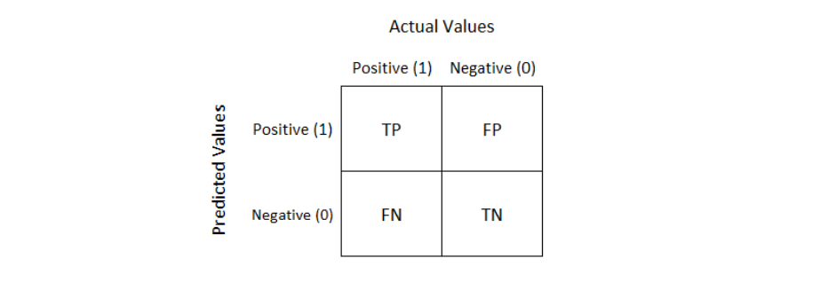
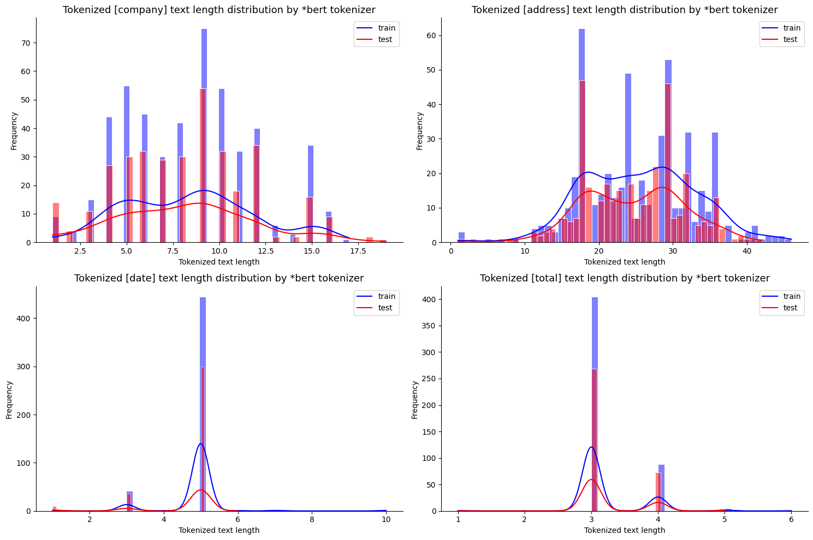

# Metric

평가 지표(Metric)으로는 f1-score를 사용합니다
<br/>

## WHY f1-score?

- 많이 사용하는 Accuracy(정확도)를 평가지표로 선정할 경우 “O” 라벨이 너무 많이 존재하기 때문에
- 핵심적인  [”company”, “date”, “address”, “total”] 라벨을 맞추지 못할지라도 대다수의 “O”만 맞춰도 점수가 지나치게 높게 나옵니다
    - 예시) target : [ “O”, “O”, “O”, “O”, “O”, “date”, “O”, “O” ] , predict : [ “O”, “O”, “O”, “O”, “O”, “O”, “O”, “O” ] 일 경우 → Accuracy :  0.87

    <br/>

    
- 이를 보완하기 위해 “O”를 True Negative로 간주하여 계산에 포함시키지 않는 Precision과 Recall을 사용합니다


    
    $$
    {Precision} = \frac{\text{True Positives}}{\text{True Positives} + \text{False Positives}}
    $$

    $$
    {Recall} = \frac{\text{True Positives}}{\text{True Positives} + \text{False Negatives}}
    $$

<br/>

- 각각을 간단히 설명하면 다음과 같습니다
    - Precision : 모델이 4가지 라벨중 하나라고 예측한 것들 중에서 실제 정답에 맞는 것의 비율
    - Recall : 실제 4가지 라벨중 하나인 것에 대해 모델이 실제 해당 라벨을 맞춘 비율

- 이 두 가지가 모두 반영되어 있는 F1-Score(Precision과 Recall의 조화평균)를 평가지표로 선정합니다

$$
{F1-Score} = 2 \times \frac{\text{Precision} \times \text{Recall}}{\text{Precision} + \text{Recall}}
$$

<br/>

## Dev의 Validation f1-score와 Test의 Validation f1-score의 계산 방식

본 baseline 코드는 학습 중에 모델의 Test 데이터셋에 대한 점수를 가늠해볼 수 있도록\
중간에 Dev 데이터셋에 대한 Validation f1-score를 주기적으로 구합니다

하지만, 최종적으로 Test 데이터셋에 대한 모델의 성능평가를 진행할 때에는\
Dev 데이터셋에 대해 진행했던 방식과는 다르게 f1-score를 구합니다

이 차이로 인해 Validation f1-score는 높지만\
실제 Test 데이터셋에 대해서는 성능이 크게 하락하는 것을 볼 수 있습니다\
(물론, 다른 이유로 Validation에 사용하는 Dev 데이터셋의 신뢰도 문제도 존재합니다)

그 이유에 대해 분석하였고, Test 데이터셋에 대해 높은 점수를 받기 위해서\
어떻게 모델을 학습해야 하는지를 이해하고 앞으로의 실험 수행 방향을 정했습니다

<br/>


### | train과정에서 evaluate 함수를 통한 f1-score


- dev 데이터가 입력으로 들어갈 때 f1-score 계산이 어떻게 되는지 살펴보겠습니다
- label이 [PAD]이 아닌 token에 대해서만 해당 token을 학습된 모델에 넣었을 때의 라벨을 예측값으로 사용합니다
- 각 샘플 단위로 모든 라벨은 2차원 리스트로 준비가 됩니다
    - target : [ [sample1_target1, tample1_target2, … ], [sample2_target1, sample2_target2, .. ]
    - predict : [ [sample1_predict1, tample1_predict2, … ], [sample2_predict1, sample2_predict2, .. ]

- 해당 데이터를 [seqeval](https://github.com/chakki-works/seqeval).metric의 precision_score, recal_score, f1_score를 활용해 점수를 구합니다
    
    ```python
    예시)
    
                  precision    recall  f1-score   support
    
         ADDRESS       0.97      0.98      0.98      3806
         COMPANY       0.90      0.99      0.94      1457
            DATE       0.95      0.90      0.93       409
           TOTAL       0.68      0.37      0.48       358
    
       micro avg       0.94      0.94      0.94      6030
       macro avg       0.88      0.81      0.83      6030
    weighted avg       0.94      0.94      0.94      6030
    ```
    
    - 각각의 점수는 아래와 같은 과정으로 구합니다.

$$
{Precision} = \frac{\text{True Positives}}{\text{True Positives} + \text{False Positives}}
$$

$$
{Recall} = \frac{\text{True Positives}}{\text{True Positives} + \text{False Negatives}}
$$

$$
{F1-Score} = 2 \times \frac{\text{Precision} \times \text{Recall}}{\text{Precision} + \text{Recall}}
$$

<br/>

- **micro avg** : 전체 True Positive, False Positive, False Negative를 가지고 계산 **[default mode]**
- **macro avg :** 각 클래스의 성능을 단순 평균
- **weighted avg** : target 데이터에 들어있는 각 클래스의 샘플 수 (support)를 고려해 가중 평균

<br/>

### | test과정에서의 evaluation.py를 통한 f1-score


- op_test가 입력으로 들어갈 때, f1-score 계산이 어떻게 되는지 살펴보겠습니다

- label이 [PAD]이 아닌 token에 대해서 해당 token을 학습된 모델에 넣었을 때의 라벨을 예측값으로 사용합니다

<br/>

- 각 샘플 단위로 모든 라벨은 2차원 리스트로 준비가 됩니다

    - predict : [ [sample1_predict1, tample1_predict2, … ], [sample2_predict1, sample2_predict2, .. ]
- 각 샘플(file) 마다 4개의 라벨 [”company”, “date”, “address”, “total”] 에 해당하는 값을 key-value 형태로 저장합니다
- value에 해당하는 단어들은 모두 “ “(공백)을 기준으로 이어붙입니다(join)
    - predict : { filename : { ”company” : “~” , “date” : “~”, “address” : “~” , “total” : “~” }, …}

<br/>

- 이미 준비되어있는 정답 key-value값을 가져옵니다
    - target : { filename : { ”company” : “~” , “date” : “~”, “address” : “~” , “total” : “~” }, …}

- 데이터가 준비되면, 파일마다 라벨 단위로 ‘정답(gold)’과 ‘예측(infer)’을 저장합니다
    - total_data : { filename : {”company” : { “gold” : “~” , “infer” : “~” } , ”data” : { “gold” : “~” , “infer” : “~” }, ”address” : { “gold” : “~” , “infer” : “~” } , ”total” : { “gold” : “~” , “infer” : “~” }, … }

<br/>

- 한 쌍의 “gold”와 “infer”가 주어지면 다음 3가지 값을 구합니다
    - **entity_em** : 완전히 동일한지(공백 고려)
    - **entity_f1** : 불필요한 기호를 제거한 이후, character-level로 분리하였을 때 f1 score
    - **entity_em_no_space** : 불필요한 기호 뿐만 아니라 공백까지 제거한 경우 완전히 동일한지(공백 고려x)

<br/>

- **최종적으로**, 모든 op_test 샘플에 대하여 **3가지 값**을 구합니다
    - **entity_em** : 전체 (gold-infer)쌍 중에서 완전히 동일한 개수 / 전체 쌍 개수
    - **entity_f1** : 모든 (gold-infer)쌍의 character-level f1 socre 합 / 전체 쌍 개수
    - **entity_em_no_space** : 전체 (gold-infer)쌍 중에서 공백을 제외하고 완전히 동일한 개수 / 전체 쌍 개수
    - 전체 쌍 개수 == (샘플 개수)*(라벨 개수==4)


<br/>
<br/>


## 높은 평가지표 점수를 얻으려면?

|  | train과정에서 evaluate 함수를 통한 점수 | test과정에서의 evaluation.py를 통한 점수 |
| --- | --- | --- |
| 사용 데이터 | dev | op_test |
| 점수 | micro avg f1-score  | 모든 (gold-infer)쌍의 character-level f1 socre 합 / 전체 쌍 개수 |
| LEVEL | word-level f1_score | char-level f1_score |

<br/>

### train과정에서 evaluate 함수를 통한 점수를 잘 얻으려면?
    
    
**[핵심 1 ]** 라벨의 Word 길이가 긴 라벨을 잘 맞추면 됩니다! (== support가 많은 라벨의 점수가 높아야 합니다)
    
    
                  precision    recall  **f1-score**   support
    
         ADDRESS       0.97      0.98      **0.98**      3806
         COMPANY       0.90      0.99      **0.94**      1457
            DATE       0.95      0.90      **0.93**       409
           TOTAL       0.68      0.37      **0.48**       358
    
       micro avg       0.94      0.94      **0.94**      6030
       macro avg       0.88      0.81      **0.83**      6030
    weighted avg       0.94      0.94      **0.94**      6030


    
- **support란?**
    - 모든 샘플에 존재하는 특정 라벨의 개수
        - 예시) `target : [ [ A, B, B, C ], [ A, B, C, D] ]`라고 할 때, \
        support의 개수는 각각 `(A : 2), (B : 3), (C : 2), (D : 1 )`
    
    - 각 샘플별 동일하게 4개의 라벨을 가짐에도 support의 개수가 차이가 나는 이유는
        - 각 라벨별 길이가 차이나기 때문입니다!\
        → support의 개수가 각 라벨별 Word 개수이기 때문!
        - 예시) `target : [ [ ‘O’, ‘address’, ‘address’, ‘address’, ‘address’, ‘O’, ‘date’, ‘O’, ‘company’, ‘company’, ‘O’, ‘total’ ], … ]` 이라 할 때
            - 맨 첫번재 샘플에 대한 support의 개수는 각각 `(address : 4), (company : 2), (date : 1), (total : 1 )`
    
    - 그러므로 **ADDRESS, COMPANY의 길이가 상대적으로 길고** 그 **f1-score의 값 또한 크기 때문에**
    - TOTAL의 f1-score점수가 낮아도 **micro avg의 점수는 전체에 대해 계산**을 하기 때문에
    - 전체의 대다수를 차지하는 ADDRESS,COMPANY의 점수를 따라갑니다
    - 실제 라벨별 길이를 확인해보면 아래와 같습니다

        


<br/>
<br/>

### test과정에서의 evaluation.py를 통한 점수를 잘 얻으려면?

- 하지만, **evaluation의 f1-score는 micro avg가 아닌** \
모든 `(gold-infer)쌍의 character-level f1 socre 합 / 전체 쌍 개수`  로 f1-score를 계산합니다
- 즉, support의 개수가 고려되지 않고 모든 라벨이 1 : 1 : 1 : 1 비율로 점수에 반영이 됩니다

    ```python
    예시)
                  precision    recall  f1-score   support
    
         ADDRESS       0.97      0.98      0.98      3806
         COMPANY       0.90      0.99      0.94      1457
            DATE       0.95      0.90      0.93       409
           TOTAL       0.68      0.37      0.48       358
    
       micro avg       0.94      0.94      0.94      6030
       macro avg       0.88      0.81      0.83      6030
    weighted avg       0.94      0.94      0.94      6030
    ```
    

- 그래서, 위에 처럼 validation 점수`(0.94)`는 높게 나오지만 
- 모든 라벨을 1 : 1 : 1 : 1 비율로 반영하는 test 단계에서의 op_test에 대한 점수는 `TOTAL` 라벨의 저조한 점수 때문에 크게 하락함을 볼 수 있습니다

<br/>
<br/>

### 그래서 op_test에 대해서 높은 평가지표 점수를 얻으려면?**
    
    # google-bert/bert-base-uncased / batch_size : 8 / step : 900
    
                  precision    recall  **f1-score**   support
    
         ADDRESS       0.98      0.98      **0.98**      3806
         COMPANY       0.93      0.99      **0.96**      1457
            DATE       0.94      0.97      **0.95**       409
           TOTAL       0.61      0.60      **0.60**       358
    
       micro avg       0.94      0.96      **0.95**      6030
       macro avg       0.86      0.88      **0.87**      6030
    weighted avg       0.94      0.96      **0.95**      6030
    
- op_test에 대해서 높은 평가지표 점수를 얻으려면, 4개의 라벨에 대해 골고루 잘해야 합니다!
- baseline에서 `ADDRESS`, `COMPANY`, `DATE`는 학습이 진행됨에 따라 잘 맞추는 것을 확인할 수 있습니다
- 하지만, `TOTAL`은 상대적으로 여전히 못맞추고 있고 \
이 때문에 op_test에 대한 f1-score의 점수 하락의 주된 원인인 것을 확인할 수 있습니다