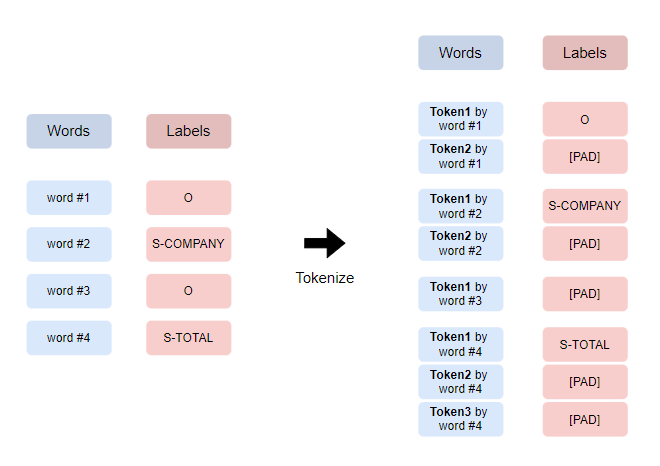
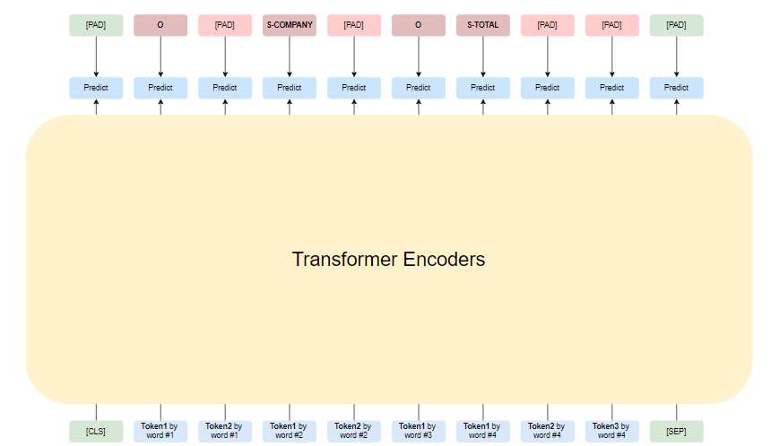
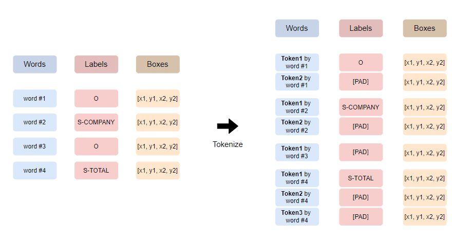
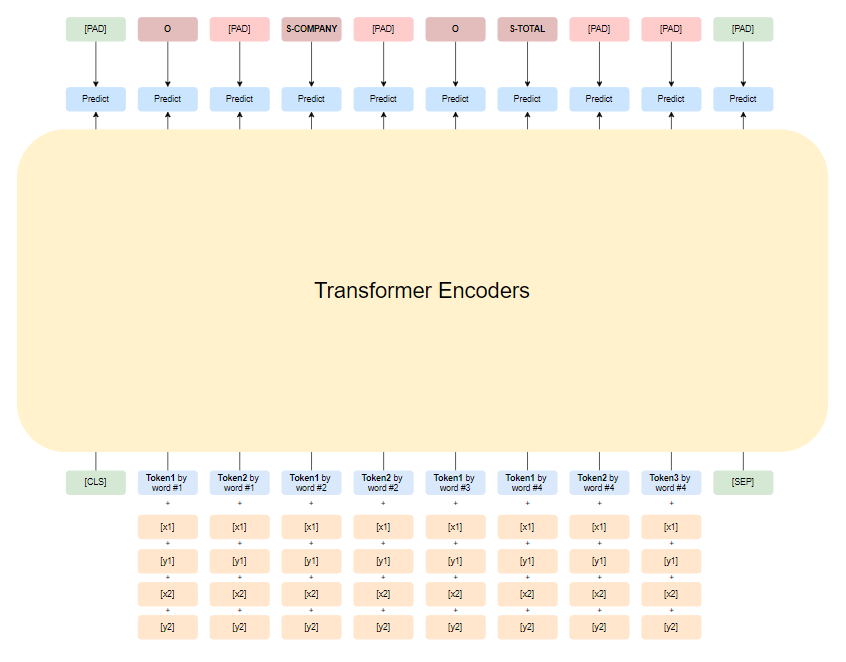

# Introduction
스캔된 영어 영수증 이미지에서 Entity를 추출하는 Task입니다 (Key-Value Extraction)

SROIE 데이터셋을 사용하며 **입력**으로 문서 이미지 대신 **단어와 그 단어에 해당하는 bounding box 좌표**가 주어졌을 때, 

그 단어에 해당하는 **Entity [company, date, address, total]**를 맞추는 NER(Named Entity Recognition) Task입니다

 

# Datasets
각 파일은 다음과 같은 정보로 이루어져 있습니다

- `*/entites` : 각 이미지에 대한 entity key-value 추출 정보
- `*/img` : SROIE 데이터셋의 이미지 파일들
- `*.txt` : 각 바운딩 박스에 대한 BIO 태그 정보가 [conll 형식](https://simpletransformers.ai/docs/ner-data-formats/#text-file-in-conll-format)으로 제공
- `*_image.txt` : 각 이미지의 각 바운딩 박스에 대한 좌표 정보
- `*_box.txt` : 각 바운딩 박스의 [정규화](https://simpletransformers.ai/docs/ner-data-formats/#text-file-in-conll-format)된 좌표 정보

`*/entities`는 훈련 또는 테스트일 수 있습니다 (예: /entities → train/entities)

 
 

# Baseline
baseline 모델 구조를 소개합니다
  

## BERT and RoBERTa Baseline Procedure
### | Tokenizing

각 단어는 라벨과 쌍으로 존재합니다\
각 단어를 Tokenizing 한 후, Token의 개수에 맞춰 라벨을 [PAD] 로 채웁니다
 

### | Modeling

- **입력**\
Special Token인 [CLS]와 [SEP]를 앞과 뒤에 붙인 후\
각 Token은 순차적으로 Transformer Encoder에 들어가게 됩니다

- **출력**\
각 Token에 해당하는 Encoder의 output 벡터입니다

- **학습**\
각 Token에 해당하는 정답 label을 맞추도록 CrossEntropyLoss를 통해 학습됩니다

 

## LayoutLM Baseline Procedure
[LayoutLM: Pre-training of Text and Layout for Document Image Understanding](https://arxiv.org/abs/1912.13318) 에서 소개된 방식입니다\
 
이미지에서 추출한 텍스트를 가지고 downstram task를 풀 때\
텍스트 뿐만 아니라 이미지 정보까지 고려하도록 구성된 모델입니다\
 

### | Tokenizing

단어, 라벨에 추가적으로 해당 단어가 추출된 이미지의 좌표정보(왼쪽 상단, 오른쪽 하단)가 사용됩니다\
이를 위와 같은 방식으로 Tokenizing 합니다

### | Modeling

- **입력**\
Special Token인 [CLS]와 [SEP]를 앞과 뒤에 붙인 후\
각 Token은 순차적으로 Transformer Encoder에 들어가게 됩니다\
추가적으로, 좌표정보 4개를 각각 임베딩한 벡터와 텍스트 임베딩 벡터의 합을 최종 입력 임베딩 벡터로 사용합니다

- **출력**\
각 Token에 해당하는 Encoder의 output 벡터입니다

- **학습**\
각 Token에 해당하는 정답 label을 맞추도록 CrossEntropyLoss를 통해 학습됩니다

